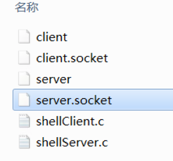

# AF_UNIX 本地通信编程示例

## 1. Linux进程通信机制

linux本地进程间通讯，大概有如下几种方式，[socket](https://so.csdn.net/so/search?q=socket&spm=1001.2101.3001.7020)本地域套接字是其中的一种。


基于socket的框架上发展出一种IPC机制，就是UNIX Domain Socket。虽然网络socket也可用于同一台主机的进程间通讯（通过loopback地址127.0.0.1），但是UNIX Domain Socket用于IPC 更有效率 ：

* 不需要经过网络协议栈
* 不需要打包拆包、计算校验和、维护序号和应答等，可靠性更强

只是将应用层数据从一个进程拷贝到另一个进程。这是因为，IPC机制本质上是可靠的通讯，而[网络协议](https://so.csdn.net/so/search?q=%E7%BD%91%E7%BB%9C%E5%8D%8F%E8%AE%AE&spm=1001.2101.3001.7020)是为不可靠的通讯设计的。UNIX Domain Socket也提供面向流和面向数据包两种API接口，类似于TCP和UDP，但是面向消息的UNIX Domain Socket也是可靠的，消息既不会丢失也不会顺序错乱。

## 1. AF_INET域socket通信过程


典型的TCP/IP四层模型的通信过程。

发送方、接收方依赖IP:Port来标识，即将本地的socket绑定到对应的IP端口上，发送数据时，指定对方的IP端口，经过Internet，可以根据此IP端口最终找到接收方；接收数据时，可以从数据包中获取到发送方的IP端口。

发送方通过系统调用send()将原始数据发送到操作系统内核缓冲区中。内核缓冲区从上到下依次经过TCP层、IP层、链路层的编码，分别添加对应的头部信息，经过网卡将一个数据包发送到网络中。经过网络路由到接收方的网卡。网卡通过系统中断将数据包通知到接收方的操作系统，再沿着发送方编码的反方向进行解码，即依次经过链路层、IP层、TCP层去除头部、检查校验等，最终将原始数据上报到接收方进程。

## 2. AF_UNIX域socket通信过程

典型的本地IPC，类似于管道，依赖路径名标识发送方和接收方。即发送数据时，指定接收方绑定的路径名，操作系统根据该路径名可以直接找到对应的接收方，并将原始数据直接拷贝到接收方的内核缓冲区中，并上报给接收方进程进行处理。同样的接收方可以从收到的数据包中获取到发送方的路径名，并通过此路径名向其发送数据。


## 3. 相同点

操作系统提供的接口socket(),bind(),connect(),accept(),send(),recv()，以及用来对其进行多路复用事件检测的select(),poll(),epoll()都是完全相同的。收发数据的过程中，上层应用感知不到底层的差别。

## 4. 不同点

1 建立socket传递的地址域，及bind()的地址结构稍有区别：

socket() 分别传递不同的域AF_INET和AF_UNIX

bind()的地址结构分别为sockaddr_in（制定IP端口）和sockaddr_un（指定路径名）

2 AF_INET需经过多个协议层的编解码，消耗系统cpu，并且数据传输需要经过网卡，受到网卡带宽的限制。AF_UNIX数据到达内核缓冲区后，由内核根据指定路径名找到接收方socket对应的内核缓冲区，直接将数据拷贝过去，不经过协议层编解码，节省系统cpu，并且不经过网卡，因此不受网卡带宽的限制。

3 AF_UNIX的传输速率远远大于AF_INET

4 AF_INET不仅可以用作本机的跨进程通信，同样的可以用于不同机器之间的通信，其就是为了在不同机器之间进行网络互联传递数据而生。而AF_UNIX则只能用于本机内进程之间的通信。

## 5. 使用场景

AF_UNIX由于其对系统cpu的较少消耗，不受限于网卡带宽，及高效的传递速率，本机通信则首选AF_UNIX域。

不用多说，AF_INET则用于跨机器之间的通信。

上文参考:

[AF_UNIX 本地通信_af unix-CSDN博客](https://blog.csdn.net/mayue_web/article/details/92798529)

## 6.AF_UNIX编程示例（C语言）

### 客户端

```c
#include <stdio.h>
#include <sys/un.h>      //sockaddr_un
#include <sys/socket.h>  //AF_UNIX、SOCK_STREAM

typedef struct
{
    char recvBuff[100];
    char sendBuff[100];
}CLIENT_PARAM;

int main(int argc, char *argv[])
{
    int serverFd,clientFd,addrLen,nwrite,nread;
    struct sockaddr_un serverAddr,clientAddr;
    CLIENT_PARAM param;

    if (argc < 2)
    {
        printf("please input param !\n");
        return 0;
    }

    unlink("./client.socket");   /* in case it already exists */

    //填充属性
    memset(&clientAddr,0,sizeof(clientAddr));
    memset(&serverAddr,0,sizeof(serverAddr));
    clientAddr.sun_family = AF_UNIX;
    sprintf(clientAddr.sun_path,"%s","./client.socket");

    //创建套接字
    if ((clientFd = socket(AF_UNIX,SOCK_STREAM,0)) < 0)
    {
        printf("err -1\n");
        return -1;
    }

    if (bind(clientFd, (struct sockaddr *)&clientAddr, sizeof(clientAddr)) < 0)
    {
        printf("err -2\n");
        close(clientFd);
        return -2;
    }

    //填充服务端信息
    serverAddr.sun_family = AF_UNIX;
    sprintf(serverAddr.sun_path, "./server.socket");
    if (connect(clientFd, (struct sockaddr *)&serverAddr, sizeof(serverAddr)) < 0)
    {
        printf("err -3\n");
        close(clientFd);
        return -3;
    }

    memset(&param,0,sizeof(param));
    sprintf(param.sendBuff,"%s",argv[1]);
    if ((nwrite = write(clientFd, param.sendBuff, 100)) < 0)
    {
        printf("err -4\n");
        close(clientFd);
        return -4;
    }

    while ((nread = recv(clientFd, param.recvBuff, 100, 0)) > 0)
    {
        printf("%s\n", param.recvBuff);
        memset(param.recvBuff, 0, sizeof(param.recvBuff));
    }

    close(clientFd);
    return 0;
}

```

### 服务器

```c
#include <stdio.h>
#include <sys/un.h>      //sockaddr_un
#include <sys/socket.h>  //AF_UNIX、SOCK_STREAM

typedef struct
{
    char recvBuff[100];
    char sendBuff[100];
}SERVER_PARAM;

int main()
{
    int serverFd,clientFd,addrLen;
    struct sockaddr_un serverAddr,clientAddr;
    SERVER_PARAM param;

    //填充属性
    memset(&serverAddr,0,sizeof(serverAddr));
    serverAddr.sun_family = AF_UNIX;
    sprintf(serverAddr.sun_path,"%s","./server.socket");

    unlink("./server.socket");   /* in case it already exists */

    //创建套接字
    if ((serverFd = socket(AF_UNIX,SOCK_STREAM,0)) < 0)
    {
        printf("err -1\n");
        return -1;
    }

    //将套接字绑定到属性对应的本地文件
    if (bind(serverFd,(struct sockaddr *)&serverAddr,sizeof(serverAddr)) < 0)
    {
        printf("err -2\n");
        close(serverFd);
        return -2;
    }

    //监听
    if(listen(serverFd,10) < 0)  //最多监听10个
    {
        printf("err -3\n");
        return -3;
    }

    while(1)
    {
        addrLen = sizeof(clientAddr);
        memset(&clientAddr,0,sizeof(clientAddr));
        memset(&param,0,sizeof(param));

        //阻塞，收到请求后返回用于本次通信的fd
        if((clientFd = accept(serverFd,(struct sockaddr*)&clientAddr,&addrLen)) < 0)
        {
            printf("err -4\n");
            continue;
        }

        //接收数据
        if(recv(clientFd,param.recvBuff,100,0) < 0)
        {
            printf("err -5");
            close(clientFd);
            continue;
        }
        printf("======== server : get cmd %s ========\n",param.recvBuff);

        //发送数据
        sprintf(param.sendBuff,"I have got your cmd %s !",param.recvBuff);
        send(clientFd,param.sendBuff,strlen(param.sendBuff),0);

        close(clientFd);
    }
    close(serverFd);

    return 0;
}
```

### 执行结果

编译客户端得到可执行文件client

编译服务器得到可执行文件server

分别运行服务器和客户端：

```
./server
./client a
```


执行之后的目录情况：

自动生成了client.socket和server.socket


