# 第一章：认识QT

**MinGW**是 Minimalist GNU for Windows的缩写，MinGW是 Windows平台上使用的GNU工具集导入库的集合。

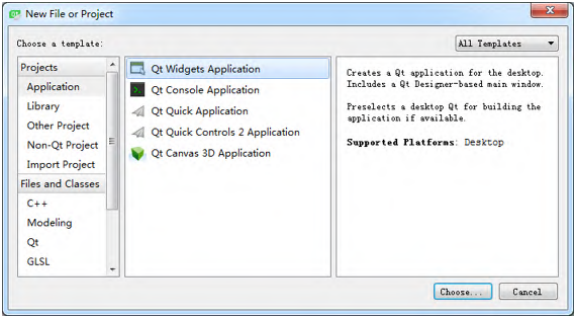

- Qt Widgets Application，支持桌面平台的有图形 用户界面（Graphic User Interface，GUI）界面 的应用程序。GUI的设计完全基于C++语言，采用Qt 提供的一套C++类库。

- Qt Console Application，控制台应用程序，无 GUI界面，一般用于学习C/C++语言，只需要简单的 输入输出操作时可创建此类项目。 Qt Quick Application，创建可部署的Qt Quick 2 应用程序。

- Qt Quick是Qt支持的一套GUI开发架 构，其界面设计采用QML语言，程序架构采用C++语 言。利用Qt Quick可以设计非常炫的用户界面，一 般用于移动设备或嵌入式设备上无边框的应用程序 的设计。 

- Qt Quick Controls 2 Application，创建基于Qt Quick Controls 2组件的可部署的Qt Quick 2应用 程序。Qt Quick Controls 2组件只有Qt 5.7及以 后版本才有。 

- Qt Canvas 3D Application，创建Qt Canvas 3D QML项目，也是基于QML语言的界面设计，支持3D画布。

  

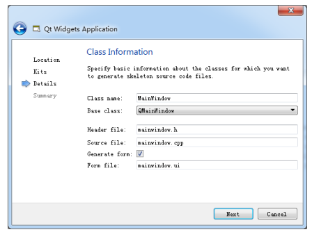

- QMainWindow是主窗口类，主窗口具有主菜单栏、 工具栏和状态栏，类似于一般的应用程序的主窗 口； 
- QWidget是所有具有可视界面类的基类，选择 QWidget创建的界面对各种界面组件都可以支持； 
- QDialog是对话框类，可建立一个基于对话框的界面。

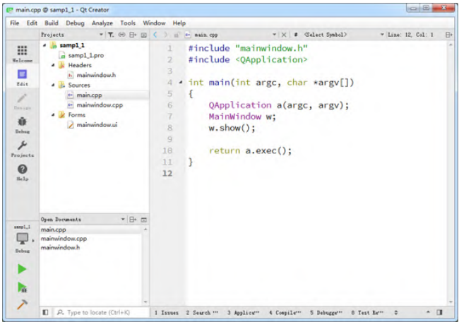

- samp1_1.pro是项目管理文件，包括一些对项目的设置项。 
- Headers分组，该节点下是项目内的所有头文件 （.h），图1-9中所示项目有一个头文件 mainwindow.h，是主窗口类的头文件。 
- Sources分组：该节点下是项目内的所有C++源文件 （.cpp），图1-9中所示项目有两个C++源文件， mainwindow.cpp是主窗口类的实现文件，与 mainwindow.h文件对应。main.cpp是主函数文件， 也是应用程序的入口。
-  Forms分组：该节点下是项目内的所有界面文件 （.ui）。图1-9中所示项目有一个界面文件 mainwindow.ui，是主窗口的界面文件。界面文件 是文本文件，使用XML语言描述界面的组成。

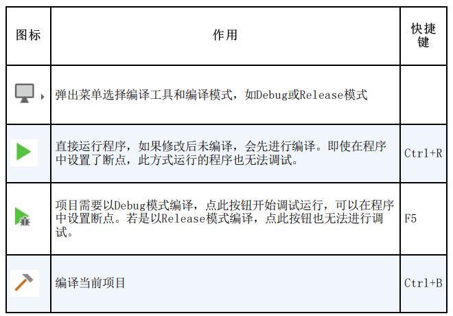


# 第2章：GUI应用程序设计基础

.pro文件的内容

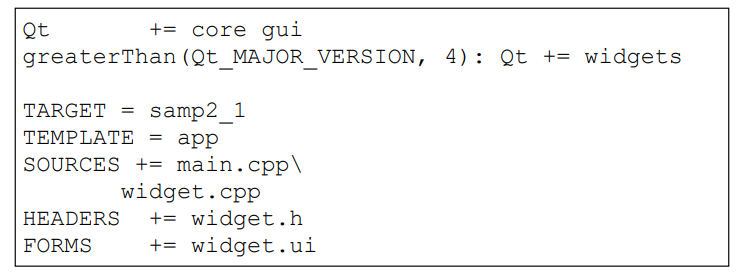

- 第一行 “Qt += core gui” 表示项目中加入core gui模 块。core gui是Qt用于GUI设计的类库模块，如果创建 的是控制台（Console）应用程序，就不需要添加core gui。

   Qt类库以模块的形式组织各种功能的类，根据项 目涉及的功能需求，在项目中添加适当的类库模块支 持。例如，如果项目中使用到了涉及数据库操作的类 就需要用到sql模块，在pro文件中需要增加如下一 行：

```c++
Qt +=sql
```

- 第二行是个条件执行语句，表示当Qt主版本大于4时， 才加入widgets模块。
- “TARGET = samp2_1”表示生成的目标可执行文 件的名称，即编译后生成的可执行文件是 samp2_1.exe。
- “TEMPLATE = app”表示项目使用的模板是app， 是一般的应用程序。 
- 后面的SOURCES、HEADERS、FORMS 记录了项目中 包含的源程序文件、头文件和窗体文件（.ui文件）的 名称。这些文件列表是Qt Creator自动添加到项目管 理文件里面的，用户不需要手动修改。当添加一个文 件到项目，或从项目里删除一个文件时，项目管理文 件里的条目会自动修改。

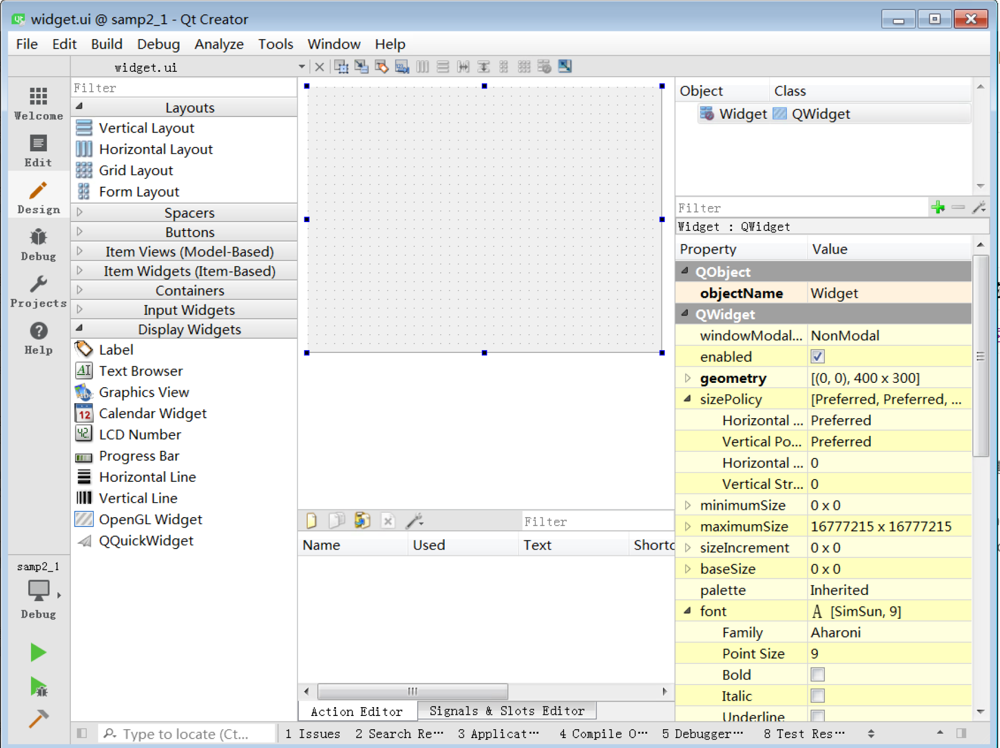

- 组件面板。窗口左侧是界面设计组件面板，分为多 个组，如Layouts、Buttons、Display Widgets等， 界面设计的常见组件都可以在组件面板里找到。 
- 中间主要区域是待设计的窗体。如果要将某个组件 放置到窗体上时，从组件面板上拖放一个组件到窗 体上即可。例如，先放一个Label和一个Push Button到窗体上。 
- Signals和Slots 编辑器与Action编辑器是位于待设 计窗体下方的两个编辑器。Signals和Slots 编辑器 用于可视化地进行信号与槽的关联，Action编辑器 用于可视化设计Action。
- 布局和界面设计工具栏。窗口上方的一个工具栏， 工具栏上的按钮主要实现布局和界面设计。 
- 对象浏览器（Object Inspector）。窗口右上方是 Object Inspector，用树状视图显示窗体上各组件 之间的布局包含关系，视图有两列，显示每个组件 的对象名称（ObjectName）和类名称。
- 属性编辑器（Property Editor）。窗口右下方是属 性编辑器，是界面设计时最常用到的编辑器。属性 编辑器显示某个选中的组件或窗体的各种属性及其 取值，可以在属性编辑器里修改这些属性的值

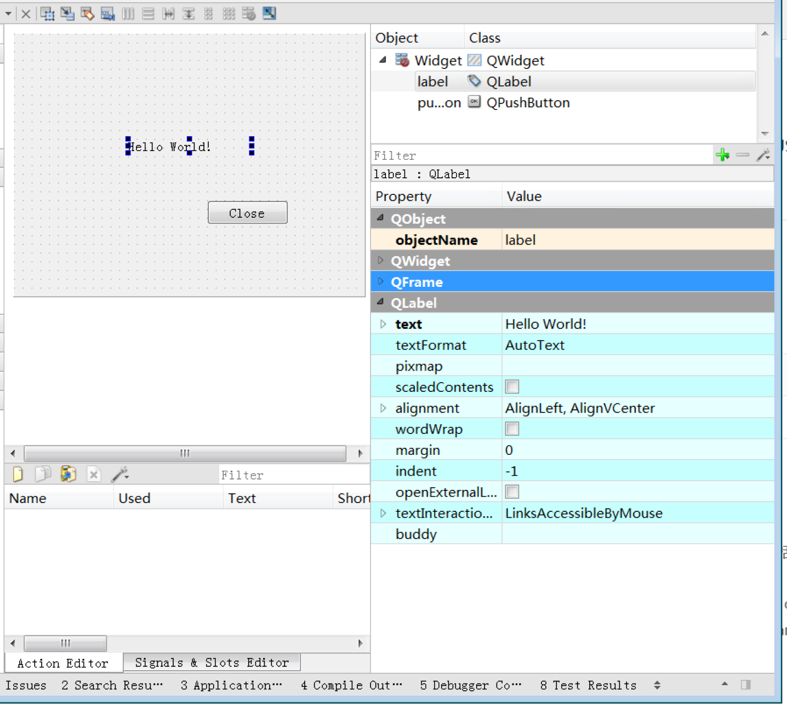

属性编辑器的内容分为两列， Property列是属性的名称，Value列是属性的值。属性又分为多个组，实际上表示了类的继承关系，如图，可以看出QLabel的继承关系是 QObject→QWidget→QFrame→QLabel。


objectName表示组件的对象名称，界面上的每个组 件都需要一个唯一的对象名称，以便被引用。界面上的 组件的命名应该遵循一定的法则，具体使用什么样的命 名法则根据个人习惯而定，主要目的是便于区分和记 忆，也要便于与普通变量相区分。

所以虽然上图中的`Label`和`PushButton`的默认`objectName`是`Label`和`pushButton`，但是我们应该把他们改成像`labelDemo`、`btnClose`这样一眼看了就知道指的是谁的名字，这样后面使用时会比较方便

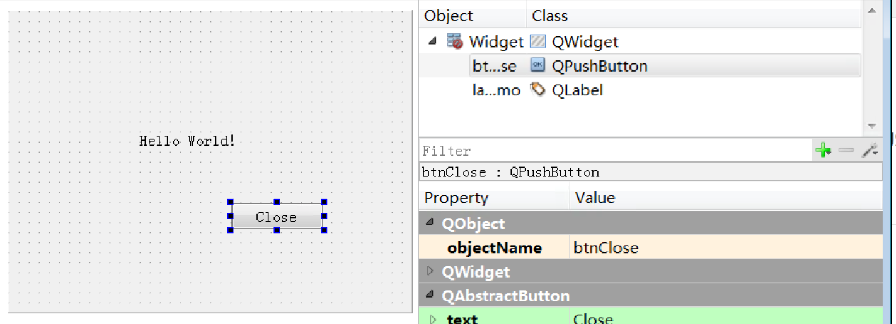

下面我们为btnClose按钮增加一个功 能，就是单击此按钮时，关闭窗口，退出程序。使用 Signals和Slots 编辑器完成这个功能

这样设置表示当按钮btnClose被单击时，就 执行Widget的close()函数，实现关闭窗口的功能。

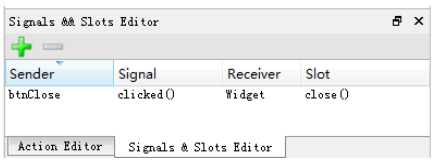


**main.cpp**

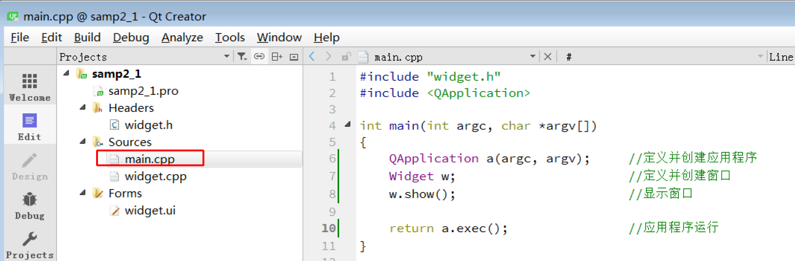


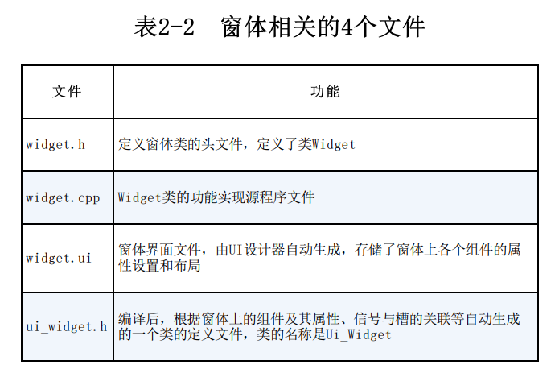

**widget.h文件**

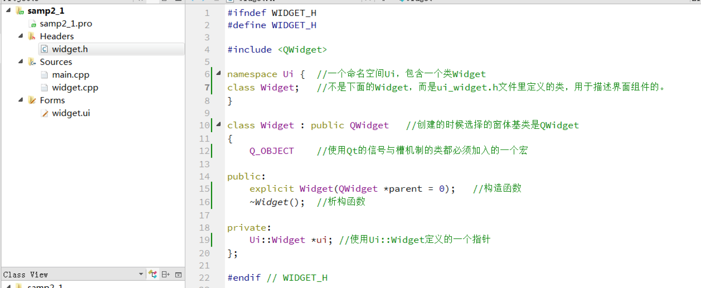

**widget.cpp文件**

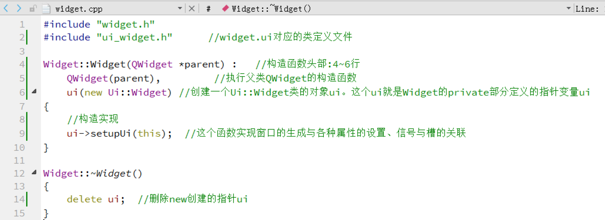

其中5~6行是构造函数的初始化列表，初始化列表中的代码在构造函数体之前执行，参考链接：

[C++中的初始化列表 - 青山牧云人 - 博客园 (cnblogs.com)](https://www.cnblogs.com/ArsenalfanInECNU/p/18080526)

