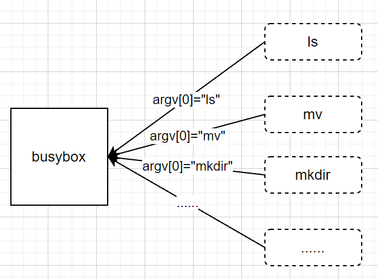
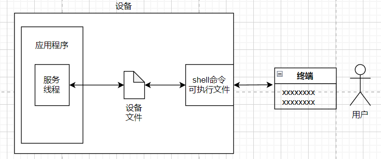
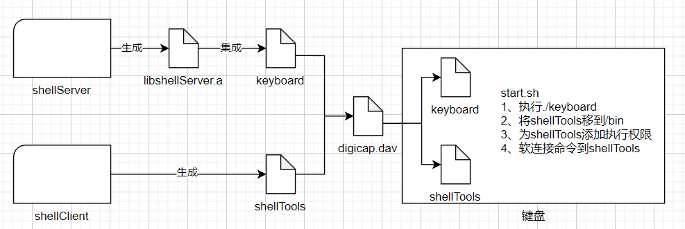
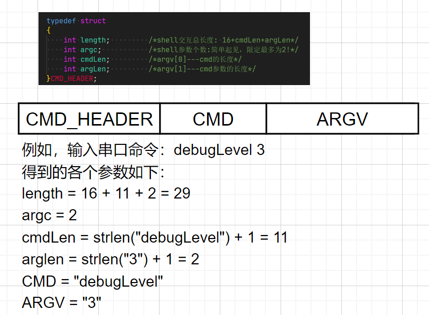
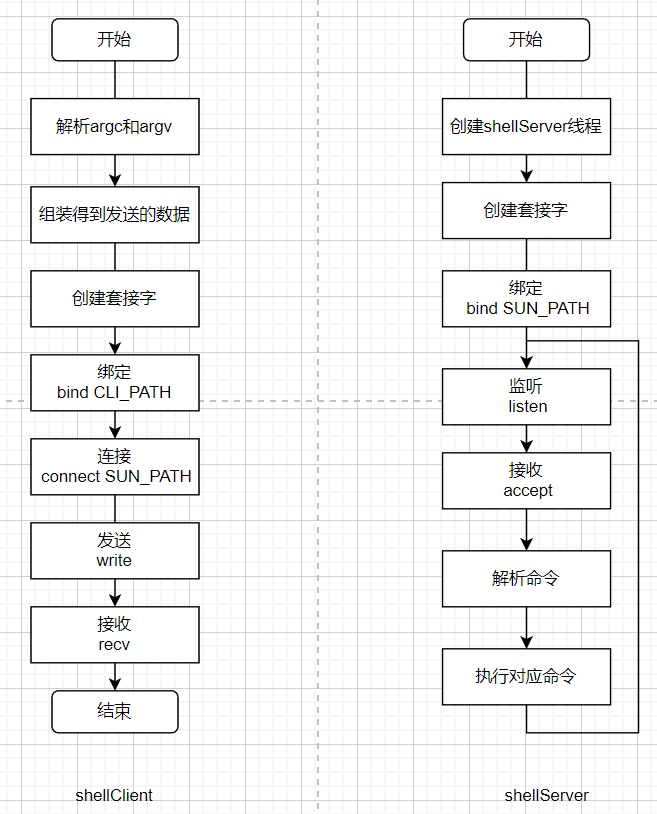

# 自定义shell命令

## **1. 背景**

我们平时使用Linux时，在串口下输入的各种指令（ls cd等）都是shell命令，这些命令提供了一条路径用于我们和Linxu系统进行交互，帮助我们获取和设置系统的参数。
但是，系统自带的shell命令并不支持获取和设置应用程序的参数，如果我们需要通过串口获取或者设置应用程序的参数，就需要实现自定义shell命令。

## **2. 基本实现步骤**

最简单的自定义shell命令只需要以下几步：
① 编译得到可执行文件（注意交叉编译）
② 将可执行文件tftp到设备中，并增加可执行权限
③ ./可执行文件名 运行，其中，该可执行文件名就是一种shell命令

但是，上述步骤③只能在可执行文件同目录下执行，并且需要./执行，怎样才能和系统的shell命令一样，在任意路径都能执行，并且不需要./呢？

Linux提供了和Windows类似的环境变量，只要把可执行文件放到环境变量路径下，就能在任意路径直接输入可执行文件名称来执行。
可以通过echo $PATH 查看当前系统的环境变量路径有哪些

```language
[root@ds1200k bin] # echo $PATH
/usr/bin:/usr/sbin:/bin:/sbin:/usr/local/sbin:/usr/local/bin
```

系统shell命令的可执行文件也都放在上述路径中，可以通过which定位某个特定shell命令的可执行文件处于哪个路径

```language
[root@ds1200k bin] # which ls
/bin/ls
```

## **3. 优化**

### 3.1 集成

那如果我们有10个自定义的shell命令，是不是需要生成10个可执行文件，然后逐个加权限，拷贝到环境目录下呢？
我们可以参考下系统的shell命令，比如上文的ls命令，which命令显示它处于/bin/下，看下同目录选是否还有一大堆别的系统命令。

可以看到ls等命令最终都被软链接指向了busybox，软链接可以理解为windows系统下的桌面快捷方式，当用户执行了ls的时候，实际上是执行了busybox，并把ls作为参数传给了busybox(也就是main函数的argv[0])。
软链接的执行命令如下，一般在系统启动后执行生效：

```language
ln -sf busybox ls
```

因此，当需要添加大量的自定义shell命令时，我们可以参考系统的shell命令，只生成一个可执行文件，在这个可执行文件中实现各个具体的命令，最后通过软链接的形式，生成和shell命令同名的数个软链接，指向该可执行文件。


### 3.2 交互

但是，怎么通过shell命令获取和设置应用程序的参数呢？现在看起来，shell命令的可执行文件也是一个应用程序，怎样才能让一个应用程序获取另一个应用程序的数据呢？我们使用基于socket套接字的C/S模式，也就是在应用程序中起一个服务线程，而把shell命令的可执行文件做成一个客户端，两者通过socket套接字交互。又由于服务线程所在的应用程序和shell命令的可执行文件处于同一个硬件系统中，所以socket不需要使用网络通信模式（AF_INET），而使用本地通信模式（AF_UNIX），数据通过本地设备文件传递，而不是通过网络传递。


## **4. 键盘代码实现**

键盘也如上文所说，使用了基于socket本地通信的C/S模式。shell命令模块位于键盘代码的组件库（modules）中,分为shellServer和shellClient两部分。
实际使用时，shellServer会先编译成静态库并被集成进键盘的应用程序（keybaord）中，而shellClient则会单独编译生成一个成果物shellTools。两者被一同压缩进升级包，在设备中再被解压。start.sh开机执行，./keyboard执行主程序并将shellTools拷贝到/bin目录并添加执行权限，同时将各个命令软链接到shellTools上。



### 4.1 shellClient的实现

键盘使用基于socket本地通信的C/S模型进行通信，因此客户端需要做的事情包括两个：

1、收集并组装需要发送的信息

2、将组装好的信息发送给指定的设备文件

由于shellClient和shellServer均处于设备内部，因此两者的通信可以使用socket的AF_UNIX（本地通信）方式进行。

发送的信息格式如下：



为了实现socket的AF_UNIX通信，需要指定两个路径：

```
#define SUN_PATH    "/var/cmd.socket"
#define CLI_PATH    "/var/"         /* +5 for pid = 14 chars */
```

其中SUN_PATH是用来写发送的数据的，而CLI_PATH是用来和服务器通信的（类似于AF_INET用端口IP组合标识出客户端），注意由于服务器需要使用该文件，

需要确保该文件有执行权限。


### 4.2 shellServer的实现

shellServer集成在主程序keyboard中，当程序启动后会新建shellServer线程，该线程主要的工作如下：

1、监听并接收客户端的请求

2、解析并调用对应的函数处理请求

其中，步骤1中需要监听的文件需要和客户端保持一致，也就是SUN_PATH、步骤2中的处理函数由各个业务模块调用下面的回调函数设置。

```
int RegShellCmd(const char* shellCmdName, int (*callbackFunc)(void*, const char *, char *), void* callbackParam);
```


### 4.3 流程图和时序图

shellClient和shellServer的流程图



以用户执行debugLevel 3为例，时序图如下：


