# 《代码大全》读书笔记


## 第1章：欢迎进入软件构建的世界

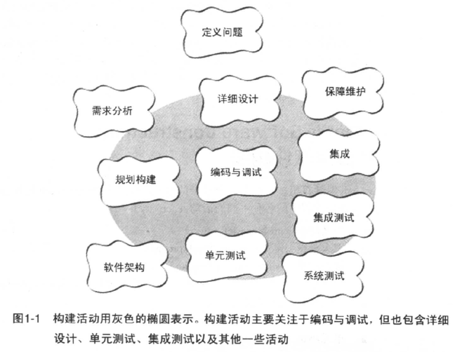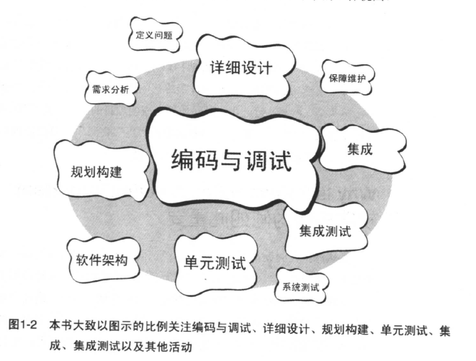

.软件构建是软件开发的核心活动;构建活动是每个项目中唯一一项必不可少的工作。
.软件构建的主要活动包括:详细设计、编码、调试、集成、开发者测试( developer testing(包括单元测试和集成测试)。
.构建也常被称作“编码”和“编程”。
.构建活动的质量对软件的质量有着实质性的影响。


## 第2章：用隐喻来更充分地理解软件开发

软件中的书法：写作代码（像写信一样无规划的一次写完，注重可读性）

软件中的耕作法：培植系统 （一次完成一部分，添加完善到系统中）

软件的牡蛎养殖观点：系统生长（像牡蛎生成珍珠一样，先形成骨架，再完成功能）

软件构造：建造软件（对大型软件而言，规划设计和建造房子一样重要）

应用软件：智慧工具箱（应该尝试使用不同的软件开发方法，丰富自己的工具）

组合各个隐喻：使用不同的隐喻解释你想解释的方面


## 第3章：三思而后行：前期准备

1、在项目的初期、中期、后期都需要强调质量。

2、在实现一个系统之前，你需要理解“这个系统应该做什么”，以及“它该如何做到这些”。

3、准备工作很重要。在开始做一个大项目之前，应该为这个项目制订计划，这是很有意义的。

从管理的角度看，做计划意味着确定项目所需要用的时间、人数以及计算机台数。

从技术角度讲，做计划意味着弄清楚你想要建造的是什么，以防止浪费钱去建造错误的东西。

有时候用户在一开始并不完全确定自己想要的是什么，因此值得花费比理想情况下更多的力气，找出他们真正想要的东西。

但这至少比“先做一个错误的东西出来，然后扔掉，并从头来过”的成本要低廉。

4、发现错误的时间要尽可能接近引入该错误的时间。

5、花费在问题定义、需求分析、软件架构上的时间，依据项目的需要而变化。

一般说来，一个运作良好的项目会在需求、架构以及其他前期计划方面投入10%-20%的工作量和20%-30%的时间(McConnell 1998, Kruchten 2000)。

这些数字不包括详细设计的时间—那是构建活动的一部分。


## 第4章：关键的“构建”决策

编程约定：在高质量软件中，你可以看到“架构的概念完整性”与“其底层实现”之间的关系。

“实现”必须与(指导该实现的)“架构”保持一致，并且这种一致性是内在的固有的。

这正是变量名称、类的名称、子程序名称、格式约定、注释约定等这些针对“构建活动”的指导方针的关键所在。

Gries对“在一种语言上编程(programming in a language )"和“深入一种语言去编程(programming into a language”做了区分。

“在一种语言上编程”的程序员将他们的思想限制于“语言直接支持的那些构件”。如果语言工具是初级的，那么程序员的思想也是初级的。

“深入一种语言去编程”的程序员首先决定他要表达的思想是什么，然后决定如何使用特定语言提供的工具来表达这些思想。


## 第5章：软件构建中的设计

设计就是把需求分析和编码调试连在一起的活动。


### 5.1 设计中的挑战

设计是一个险恶的问题：有些问题，是得在程序运行后才能发现的

设计是个了无章法的过程：设计时会犯很多错误再改正、优劣方案之间差异很微妙，设计到什么程度、怎样才算是“好的”等等都没有指标。

设计就是确定取舍和调整顺序的过程：在各种指标间取舍，比如运行速度和占用内存、开发时间和运行速度等。

设计收到诸多约束：受软件规格和硬件条件等限制。

设计是不确定的：每个人有每个人的设计思路。

设计是一个启发式过程：在一件工作上十分奏效的工具或技术，在下一个项目上可能并不适用，所有要抱着“试试没准能行”的探索性的心态。

设计是自然而然形成的：设计是在不断的设计评估、非正式讨论、写验证代码以及修改验证代码的过程中演化和完善的


### 5.2 关键的设计概念

复杂度：

当项目因为技术原因导致失败时，往往是因为失控的复杂度。有关的软件变得极端复杂，让人无法知道它究竟是做什么的。

当没人知道对一处代码的改动会对其他代码带来什么影响时，项目也就快停止进展了。

在软件架构的层次上，可以通过把整个系统分解为多个子系统来降低问题的复杂度。

人类更易于理解许多项简单的信息，而不是一项复杂的信息。所有软件设计技术的目标都是把复杂问题分解成简单的部分。

子系统间的相互依赖越少，你就越容易在同一时间里专注问题的一小部分。精心设计的对象关系使关注点相互分离，从而使你能在每个时刻只专注于一件事情。

在更高汇聚的层次上，包(packages)提供了相同的好处。

理想的设计特征：

① 最小的复杂度：做简单易懂的设计，不要做“聪明的”设计，否则难以理解，增加了复杂度。

② 易于维护：想下后续维护的程序员看到你的代码是否会有疑问

③ 松散耦合：设计时让程序的各个组成部分之间关联最小。

通过应用类接口中的合理抽象、封装性及信息隐藏等原则，设计出相互关联尽可能最少的类。减少关联也就减少了集成、测试与维护时的工作量。

④ 可扩展性：可以改动系统的一部分而无需破坏底层结构。

⑤ 可重用性： 所设计的系统的组成部分能在其他系统中重复使用

⑥ 高扇入(本身被调用的量)：让大量的类使用给定的某个类。这意味着设计出的系统很好地利用了在较低层次上的工具类。

⑦ 低扇出(自身调用别的函数的量)：一个类里少量或者适中地使用其他类。

⑧ 可移植性：方便地移动到其他环境中

⑨ 精简性：系统没有多余部分，多余的部分也是要测试和后续维护的。

⑩ 层次性：保持系统各个分解层的层次性，使你可以在任意层面上观察系统。

⑪ 标准技术：用标准化的，常用的方法，让系统给人一种熟悉的感觉。

设计的层次

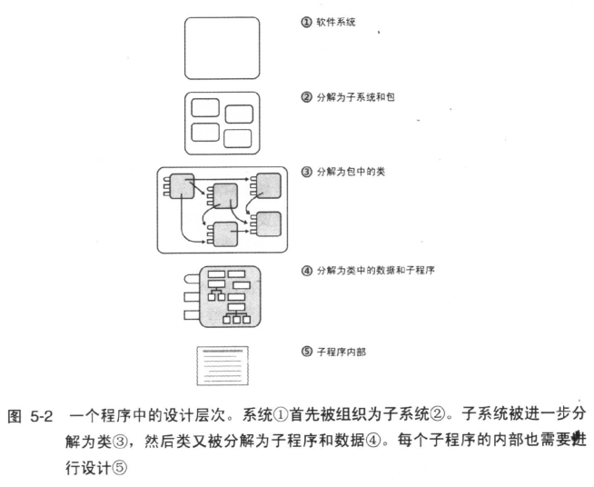

① 软件系统：避免直接在这一层直接设计类，而是分成子系统和包

② 分解为子系统和包：明确分成哪些子系统、各个子系统之间的关系、各个子系统之间怎么通信。

分成各个子系统的意义就在于限制各个部分之前的通信，降低复杂度。因此要避免所有子系统都能和其他子系统通信。

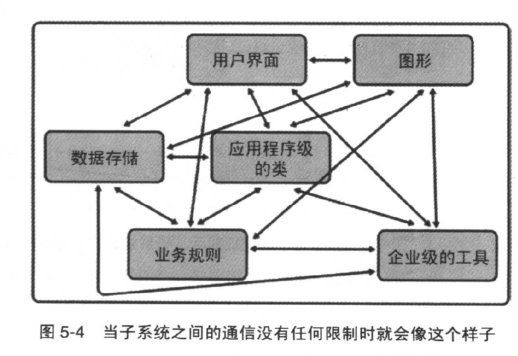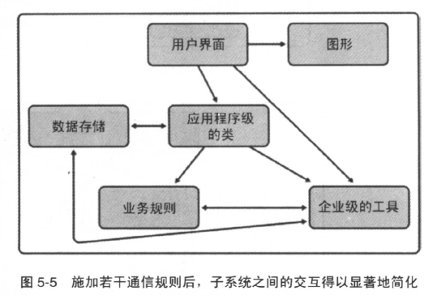

有一个很好的基本原则：像5-5这样的图，不应该出现任何环形关系。

③ 分解为类：识别出系统中所有的类，同时定义了这些类和系统其他部分打交道的细节，尤其是确定好类的接口。

④ 分解成子程序：③中已经定义了接口，这一层主要定义私有程序

⑤ 子程序内部的设计：完成具体的函数


### 5.3  设计构造块：启发式方法

由于软件设计是非确定性的（很多问题不可预见），因此，灵活熟练地运用一组有效的启发式方法(试探法)，

便成了合理的软件设计的核心工作。下面是一些常用的启发式方法：

① 找出现实世界中的对象：如果你写的是一个收银员相关的程序，可以参看现实中的收银员有哪些属性

② 形成一致的抽象：从各种细节中找出真正有影响的、共性的参数。比如基类抽象出了各个子类的共性，

类的接口让你只要关心怎么调用接口，而不用关心接口怎么实现。

③ 封装实现细节：封装填补了抽象留下的空白。抽象是说:“可以让你从高层的细节来看待一个对象。”而封装则说:

“除此之外，你不能看到对象的任何其他细节层次。”，比如函数封装让你仅关心接口怎么调用，而无需关心实现方式。

④ 当继承能简化设计时就继承：一些共性的操作，子类完全可以继承。

⑤ 隐藏秘密（信息隐藏）：一来可以降低复杂度，二来可以增加安全性和可维护性（只有类内的函数才能访问）

⑥ 找出容易改变的区域：要识别出哪部分后续可能会改变，并为改变做好准备。

⑦ 保持松散耦合：请尽量使你创建的模块不依赖或者很少依赖其他模块。让模块之间的关系像商业合作者一样彼此分离，

而不是像连体婴儿那样紧密相连。函数传参尽量少、类的public接口尽量少、尽量使用传参而不是全局变量传递数据，

让函数的传参更灵活易被识别。

⑧ 查阅常用的设计模式：使用公用的方式方法可以省下很多的理解成本

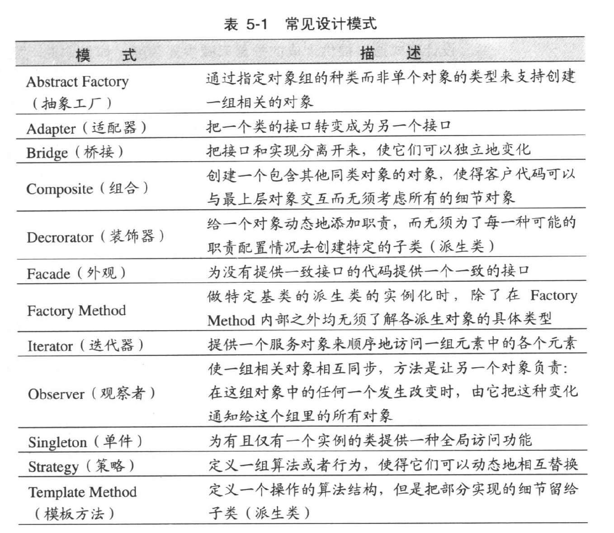

⑨ 使用启发式方法的原则： 不要卡在单一的方式上，不要卡在一个问题上，可以先往下，后续再来解决这个问题。


### 5.4 设计实践

迭代：尝试从高层和底层审视问题，这有助于完善方案。有了好的方案就执行，执行中也能从中学习改善原有的方案。

分而治之：将程序分成不同区域开发

自上而下和自下而上的设计方法：自上而下的设计从某个很高的抽象层次开始。你定义出基类或其他不那么特殊的设计元

素。在开发这一设计的过程中，你逐渐增加细节的层次，找出派生类、合作类以及其他更细节的设计元素。

自下而上的设计始于细节，向一般性延伸。这种设计通常是从寻找具体对象开始，最后从细节之中生成对象以及基类。

建立试验性模型：对有疑虑的问题，写测试程序验证下

合作设计：和同时交流，评审方案等

要做多少设计才够：越多越好

记录你的设计成果：注释、文档、wiki、邮件总结等


### 5.5 对流行的设计方法的评论

介绍了一些别的书籍、文档


## 第6章：可以工作的类

### 6.1 类的基础：抽象数据类型（ADTs）

抽象数据类型(ADT, abstract data type)是指一些数据以及对这些数据所进行的操作的集合。这些操作既向程序的其余部分描述了这些数据是怎么样的，

也允许程序的其余部分改变这些数据。


**需要用到ADT的例子**

```c++
currentFont.size = 16 //将字体大小设置为16
currentFone.attribute = CurrentFont.attribute or 0x02 //将字体设置为粗体
```

上面的调用存在的问题:

1、调用方直接操作了数据成员，并且得知道操作的逻辑。

2、像这样的调用在代码中会到处都是，要修改的话就得都改一遍


**使用ADT的益处**

应该如下使用：

```c++
currentFont.setSizeInPoints(sizeInPoint)	//设置字体大小
currentFont.setBoldOn()		//设置为粗体
```

好处如下：

1、可以隐藏实现细节：使用者不需要知道怎么操作成员。

2、改动不会影响到整个程序：诸如粗体的实现方式改变，不需要调用者修改。

3、让接口提供更多的信息：setSizeInPoints这样的命名就在提醒你要注意传入数据的单位，currentFont.size = 16没有这个功能

4、更容易提高性能：当你想提高修改粗体的性能时，修改一个方法比修改一堆调用省事。

5、让程序的正确性显而易见：currentFone.attribute = CurrentFont.attribute or 0x02 比 currentFont.setBoldOn()  要容易写错

6、程序更具有自我说明性：看setBoldOn这样的名称就知道它干了啥

7、无需在程序内导出传递数据：

没有类的话，凡是想要操作currentFont的成员变量，都得把它做为入参或者把它作为全局变量。

有了类的话，类的成员函数可以直接访问类的成员变量而不用作为参数传入。

8、你可以像在现实世界中那样操作实体，而不用在底层实现上操作它：

程序的绝大部分可以使用setBoldOn这种更接近现实中的字体操作语言，而不是currentFone.attribute = CurrentFont.attribute or 0x02 这样难以理解的代码。


**更多的ADT示例**

总而言之，就是整理出一套对外的浅显易懂的接口，用户只需要调这些接口就行，而不用关心接口的实现方式。

一些建议：

1、把常见的底层数据类型创建为ADT并使用这些ADT，而不是使用底层数据类型：比如为堆栈、列表、链表创建一个类，并对外提供它的各个使用方法函数，而不是直接使用这些数据类型。

2、把像文件这样的常用对象当做ADT：把文件操作定义成一个类的多个函数

3、简单的事情也可以当做ADT：就算是一个事物只有开关两个操作，也是可以定成类的

4、不要让ADT依赖于其存储介质：成员函数名不要带着信息，让使用者知道它存在哪里（内存还是磁盘），否则到时候改了存储方式，名称就错了


**在非面向对象环境中用ADT处理多分数据实例**

比如C语言，结构体没有成员函数的说法，这些函数均以独立的函数形式存在。

那怎么让下面的函数修改同一个字体结构体的数据呢，有以下的方法：

```c++
FONT_TYPE font1
setSizeInPoints(sizeInPoint)	//设置字体大小
setBoldOn()		//设置为粗体
```

1、增加“创建”、“删除”之类的函数，在里面创建和删除一个全局的FONET_TYPE对象，然后每个操作函数调用的时候都传一个id，用于区分操作的是哪个。

2、把每个函数的入参都改为完成的结构体FONT_TYPE，函数直接修改入参的内容，这样就不用传id了。

3、新增一个函数，指定当前操作的是FONT_TYPE结构体数组的哪个，后续的操作函数均操作这个对象。

总而言之，都不好，1需要加id，2会把FONT_TYPE暴露给用户，3增加了复杂度。


**ADT和类**

ADT的思想是类这一概念的基础，类是对ADT思想的一种实现方式。


### 6.2 良好的类接口


**1、好的抽象**

类的接口应该能提供一组明显相关的子程序。比如一个实现雇员的类，其中的子程序应该都和雇员有关系。

如果一个类中杂糅了很多不同功能的子程序，比如命令栈、报表、操作全局数据，那么应该考虑把他们分开到不同的更专一的类中。

下面是一些建议：

1、类的接口应该展现一致的抽象层次。

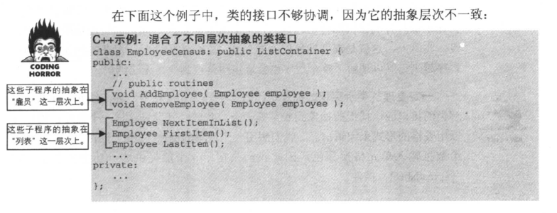

这个类展现了两个ADT: Emplyee和ListContainer。出现这种混合的抽象，通常是源于程序员使用容器类或其他类库来实现内部逻辑，

但却没有把“使用类库”这一事实隐藏起来。应该修改如下：

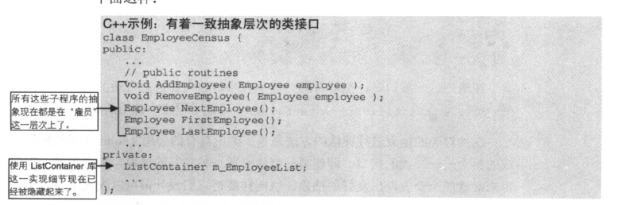

2、一定要理解类所实现的抽象是什么。

一个例子：有一个功能，需要A类的所有15个功能和B类150个功能中的的其中一个，那么如果新建一个包裹类的话，

这个类只需要对外暴露出A类的15个 + B类的1个子程序。

3、提供成对的服务。

写一个操作开的函数的时候，考虑下程序是有有必要写一个操作关的函数。

4、把不相关的信息转移到其他类。

如果你发现你的类中，一半程序在使用一半的数据，另一半程序在使用另一半数据，说明这两部分毫无关系，可以考虑拆成2个类。

5、尽可能让接口可编程，而不是表达语义。

让尽量多的错误能够被程序发现并报错，减少那些需要看注释和理解才能发现的错误。

6、谨防在修改时破坏接口的抽象。

比如在修改的时候，给雇员类加对外接口的时候，加了一堆查邮政编码的接口

7、不要添加与接口抽象不一致的公共成员。

比如在修改的时候，给雇员类加了一个插入链表节点的接口

8、同时考虑抽象性和内聚性。

抽象做的越好，类的各个函数之间的关系也应该是越紧密的。


**2、良好的封装**

抽象让你可以忽略实现的细节，直接调用接口来降低复杂度，而封装强行阻止你看到细节。

也就是说，如果封装得好的话，你也就不得不做抽象了:laughing:。

下面是一些建议：

1、尽可能地限制成员的可访问性

没有公开必要的函数和变量，都定义成private

2、不要公开暴露成员数据

如果你向下面这样直接暴露成员变量，那别的地方将可以自由修改它们，而类甚至不知道它被修改了

```c++
float x;
float y;
float z;
```

应该改成如下：

```c++
float GetX();
float GetY();
float GetZ();
void SetX(float x);
void SetY(float y);
void SetZ(float z);
```

这样的好处是：

① 类能得知外接对变量的访问和修改 

② 向外接隐藏了变量的类型，因为类内部可能是保存成double，然后对外时转成float的

3、避免把私用的实现细节放入类的接口中。

C++头文件的private部分还是会暴露部分细节：比如变量的保存类型

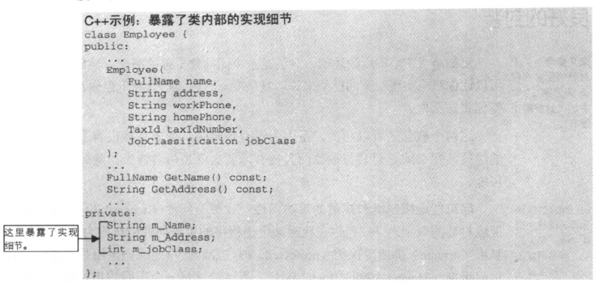

有一种方法，如下：

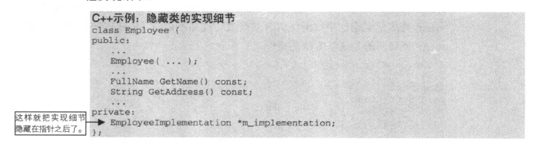

现在你就可以把实现细节放到EmployeeImplementation类里了，这个类只对Employee类可见，而对使用Employee类的代码来说则是不可见的。

4、不要对类的使用者做出任何假设。

接口不要有潜规则，比如“大家都知道：被除数是0的话会崩溃，所以调用者不会把X=0传进来”。

5、不要因为一个子程序仅使用公用子程序，就把它归入公开接口。

要考虑下把它公开后，接口所展示的抽象是否还一致。

6、让阅读代码比编写代码方便

不要为了编写代码方便而降低它的可读性，因为看代码的时间比写代码的时间要多得多

7、要格外警惕从语义上破坏封装性。

一些例子：

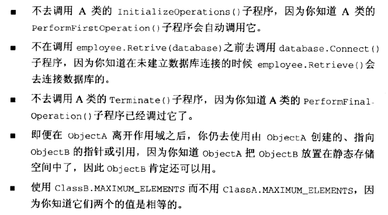

它们让调用代码不是依赖于类的公开接口，而是依赖于类的私用实现。

8、留意过于紧密的耦合关系

一些建议：

① 尽可能地限制类和成员的可访问性

② 避免友元类，因为他们之间是紧密耦合的

③ 在基类中把数据声明为private而不是protected，以降低派生类和基类之间耦合的程度

④ 避免在类的公开接口中暴露成员数据

⑤ 要对从语义上破坏封装性保持警惕

⑥ 察觉“Demeter(得墨忒耳)法则”(见 6.3节)


### 6.3 有关设计和实现的问题

这一节讨论关于包含、继承、成员函数和数据成员、类之间的耦合性、构造函数、值对象与引用对象的问题。


**1、包含（“有一个....”的关系）**

雇员类有一个“姓名”、有一个“电话”之类的数据成员，这样的关系是包含。

一个类包含的数据成员不要太多，超过7个就可以考虑是不是要拆成多个类


**2、继承（“是一个...”关系）**

继承的概念是说一个类是另一个类的特化。

继承可以把多个子类共有的元素（接口、内部实现、数据成员、数据类型等）放到一个基类中，这样就不用反复实现了。

当决定要继承时，需要考虑：

① 对于成员函数：它对派生类应该可见吗？ 是否要有默认实现？ 这个默认实现是否能被覆盖？

② 对于成员变量：它对派生类是否可见

下面是一些建议：

1、没有必要的话不要继承，不然会增加复杂度

2、如果你只是想使用另一个类的某个算法，直接拿来用而不是去继承那个类

3、派生类中的成员函数不要和基类的private函数重名，虽然不会报错，但难以阅读

4、如果子类只有一个实例，是不是不需要派生成类，而是用数据表达和基类之间差异的部分。（单件模式是本条建议的例外）

5、不要创建没必要的集成结构，比如给当前真正工作的类抽象出一个基类

6、把基类的函数集成下来，然后覆盖成一个啥也不做的函数，会让人无法确定调这个接口到底会不会执行

7、不要有过多的继承层次

8、让所有数据都是private（而非protected）。继承会破坏封装，当你从一个对象继承时，你就拥有了访问该对象中

protected子程序和protected数据的特权。


**多重继承**

多重继承指一个子类同时继承多个父类。

常见的应用比如：有多个工具类，比如链表类、显示类，我们的子类需要使用到这些工具，可以多重继承。

多重继承需要注意几个父类之间要相互独立。


**为什么要有这么多继承的规则**

为了控制复杂度，不好的继承会让程序的复杂度提升。

下面是一些归纳总结：

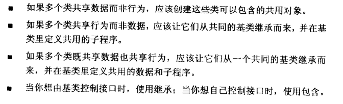


**3、成员函数和数据成员**

一些建议：

1、类中的子函数尽量少

2、类中调用的子程序数量尽量少

3、对其他类的子程序的间接调用要尽可能少（A类对象中生成B类对象，B类对象再生成C类对象，最后在A中执行了C的函数）


**4、构造函数**

一些仅针对构造函数的建议：

1、如果可能，应该在所有构造函数中初始化所有数据成员

2、用私用（private）构造函数来强制实现单件属性

如果你想定义一个类，并需要强制规定它只能有唯一一个对象实例的一话，可以把该类所有的构造函数都隐藏起来，

然后对外提供一个static的子程序来访问该类的唯一实例。它的工作方式如下例所示:

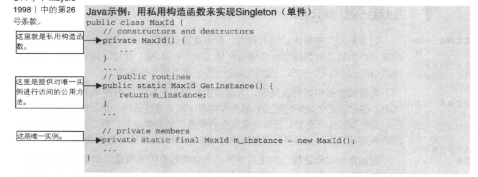

3、优先使用深层复本（深拷贝取得），除非论证可行，才采用浅层复本（浅拷贝取得）


### 6.4 创建类的原因

1、为现实中的对象建模。

2、为抽象对象建模，比如形状类。

3、降低复杂度。让使用者只需要关注接口，而不需要关注具体实现

4、隔离复杂度。一旦发生错误，修改范围也会比较小

5、隐藏实现细节。

6、限制变动的影响范围。

7、隐藏全局数据。

8、让参数传递更顺畅。类中的成员函数可以直接访问类的成员变量而不用传参

9、建立中心控制点。

10、让代码更易于重用。

11、为程序族做计划。把预计会改动的部分放到单独的类中，这样后面更新的时候只要修改它而不会影响别的部分。

12、把相关操作包装在一起

13、实现某种特定的重构


应避免的类：

1、万能的，什么事情都做的类

2、不必要的类：只包含数据，不包含行为

3、避免用动词命名的类：只有行为而没有数据


### 6.5 与具体编程语言相关的问题

不同的语言在类的实现上有差异。

在C++中继承默认不覆盖基类的方法，基类的方法必须被定义成virtual才能被覆盖


### 6.6 超越类：包

模块化的发展：语句   =>  子函数  =>  类   =>  包


## 第7章：高质量的子程序

本章介绍那些关乎子程序好坏的特征。

 ### 7.1 创建子程序的正当理由

1、降低复杂度。

2、引入中间、易懂的抽象。相当于把一段代码抽象成了一行

3、避免代码重复。

4、支持子类化。覆盖一个简短的功能简单的子程序比较简单

5、隐藏顺序。一旦你把"把大象放进冰箱"写成了子程序，使用者就不需要知道 开门-放大象进去-关门 的步骤

6、隐藏指针操作。指针太危险，但如果都在一个函数内，修改起来还是容易的。

7、提高可移植性。可以使用子程序来隔离程序中不可移植的部分。

8、简化复杂的布尔判断。有些地方只想知道判断结果，并不关心细节，可以写子程序

9、改善性能。优化的时候，你只要改子程序一个地方，所有用到的地方都得到了优化。


**似乎过于简单而没有必要写成子程序的操作**

为很短但是很难理解的语句写个子程序，方便阅读，在写程序的时候也会思考更深，做更周全的判断。


### 7.2 在子程序层上设计

对子程序而言，**内聚性**是指子程序中各种操作之前联系的紧密程度。可以简单理解为这个函数完成了几个任务，完成的越少，内聚性越高。

下面是一些内聚性的例子：

1、功能的内聚性。最强也是最好的一种内聚性，也就是说一个子程序仅执行一项操作。

2、顺序上的内聚性。比如需要根据生日得到年龄和退休时间，先根据**生日**得到年龄，再根据**年龄**得到退休时间，则有顺序上的内聚性（按顺序）。

3、通信上的内聚性。比如需要根据生日得到年龄和退休时间，先根据**生日**得到年龄，再根据**生日**得到退休时间，则只有通信上的内聚性（仅共享数据）。

4、临时内聚性。是指一些互不相关，但是需要放一起才能实现某项功能的子程序。

比如StartUp()这种开机做一大堆杂事的函数，但这些杂事都应该写成子函数，让StartUp()去调用。

5、过程上的内聚性。指一个子程序中的操作是按特定的顺序进行的。

比如按屏幕提示，依次输入袁工姓名、地址、电话号码的子程序。

6、逻辑上的内聚性。

那些包含多个if else或者case的函数

7、巧合的内聚性。子程序的操作之间没有任何可以看到的联系

除上述以外的，也可以说是没有内聚性的函数。


### 7.3 好的子程序名字

一些原则：

1、描述子程序做的所有事情。

2、避免使用无意义的、模糊或表达不清的动词。比如 handle、deal with、process等

3、不要仅通过数字来形成不同的子程序名字。比如 fun1、fun2

4、根据需要确定子程序名字的长度。最佳长度在9到15个字符

5、对函数命名时要对返回值有所描述。如果有返回值，函数名最好体现出返回了啥，比如printer.IsReady()

6、给过程起名时使用动词+宾语，在面向对象时则不必要。

比如，面向过程时，printDocument是一个好的函数名，但面向对象时，document.printDocument就显得太臃肿了

7、准确使用反义词

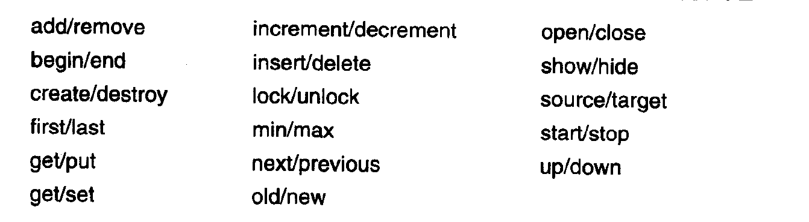

8、为常用操作确立命名规则

下面是没有命名规则下出现的各种获取id的调用方式

```c++
employee.id.Get();
dependent.GetId();
supervisor();
candidate.id();
```

所以，还是统一一下比较好。


### 7.4 子程序可以写多长

有各种函数长度和出错概率的说法，总而言之，尽量不要超过200行。


### 7.5 如何使用子程序参数

子程序之间的接口是最容易出错的部分之一，以下是一些传参方面的建议。

1、按照 输入--修改--输出 的顺序排列参数。

```c++
//input 仅做输入 
//fixed 既是输入又是输出
//out 仅做输出
int func(int input, int *fixed, int *out);  
```

2、考虑自己创建in和out 关键字。

```c++
#define IN
#define OUT
#define IO
int func(IN int input,IO int *fixed,OUT int *out);  
```

3、如果几个子程序使用的参数类似，应该让他们的排列顺序也保持一致。

4、使用所有的参数。既然传了这个参数，就一定要用到。

5、把状态或出错变量放最后。标记函数执行后状态和错误的变量仅作为输出，所以放最后。

6、不要把子程序的参数用作工作变量。比如，不要把传参最后作为返回值

7、在接口中对参数的假定加以说明。

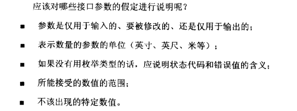

8、把子程序的参数个数限制在大约7个以内。

9、考虑对参数采用某种表示输入、修改、输出的命名规则。比如：i_ , m_ , o_

10、传参不要破坏抽象。我的理解是尽量少

11、实参和形参类型要对应


### 7.6 使用函数时要特别考虑的事情


### 什么时候用函数、什么时候用过程

函数：返回值非void  过程：返回值为void

自家看着办，如果使用函数，那么函数可以使用它的返回值命名


**设置函数的返回值**

每个return都检查下有没有正确返回

不要返回指向局部数据的引用或指针


### 7.7 宏子程序和内联子程序


**宏子程序**： #define FUNC(a) 3*a 之类的

1、把宏表达式整个包含在括号内

```c++
#define Cube(a) a*a*a			//不能正确展开，比如传入的是 x+1
#define Cube(a) (a)*(a)*(a)		 //任然不能正确展开，比如调用Cube前后有比*更优先的运算符
#define Cube(a) ((a)*(a)*(a))    //可以正确展开
```

2、把含有多条语句的宏用大括号括起来

```c++
//错误的示范
#define lookUp(key)	\
	key += 1;	   \
	key += 2;	   \ 
	key += 3;
	
for(int i = 0; i < 10; i++)
	lookUp(i);	//展开后只会执行key += 1 这一行
```

所以应该改成

```c++
//正确的示范
#define lookUp(key)	\
{ \
	key += 1;	   \
	key += 2;	   \ 
	key += 3;	   \
}
	
for(int i = 0; i < 10; i++)
	lookUp(i);	
```


**内联子程序**

关键字 **`inline`** 建议编译器使用函数定义中的代码替换对该函数的每次调用。

因为直接替换代码比走调用流程更快，所以能加速程序运行，作为代价是程序的大小可能会增加。

在以下类声明中，`Account` 构造函数是内联函数，因为它是在类声明的正文中定义的。 成员函数 `GetBalance`、`Deposit` 和 `Withdraw` 是在其定义中指定的 `inline`。 关键字 `inline` 在类声明中的函数声明中是可选的。

```c++
// account.h
class Account
{
public:
    Account(double initial_balance)
    {
        balance = initial_balance;
    }

    double GetBalance() const;
    double Deposit(double amount);
    double Withdraw(double amount);

private:
    double balance;
};

inline double Account::GetBalance() const
{
    return balance;
}

inline double Account::Deposit(double amount)
{
    balance += amount;
    return balance;
}

inline double Account::Withdraw(double amount)
{
    balance -= amount;
    return balance;
}
```

1、节制使用 **`inline `**函数。因为C++要求程序员把内联函数的实现写在头文件中，因此破坏了封装性。


 ## 第8章：防御式编程

防御式编程的主要思想：子程序不因传入错误数据而被破坏，哪怕是由其他子程序产生的错误数据。

本章介绍怎么对你的程序做保护。


### 8.1 保护程序免遭非法输入数据的破坏

1、检查所有来源于外部的数据的值。程序运行中调用外部接口获取到的数据。检查数值是否在范围内、字符串是否超长等

2、检查子程序所有传入参数的值。

3、决定如何处理错误的输入数据。检测到错误，做出恰当的反应


### 8.2 断言

断言（assertion）是指在开发期间使用的、让程序在运行时进行自检的代码(通常是一个子程序或宏)。

断言为真，则表明程序运行正常，而断言为假，则意味着它己经在代码中发现了意料之外的错误。

一般断言被用在开发调试阶段、在生成产品代码时，可以不编译进去，以免降低系统性能。

也就是说：**断言只拿来判断那些发布程序中绝不允许出现的情况**

```c++
#define _assert(ex)    \
{ \
    if ( !(ex) ) \
    { \ 
        (void)syslog(LOG_ERR,"Assertion failed: file \"%s\", line %d\n", __FILE__, __LINE__); \
        exit(1); \
    } \
} \
```


**建立自己的断言机制**

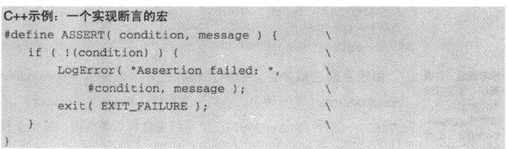

**使用断言的一些建议**

1、断言仅判断那些绝对不应该出现的错误，并且一旦触发，处理措施应该是修复使其不触发而不是给错误打印等

2、避免把需要执行的代码放到断言中，因为发布的时候断言是不编译进去的


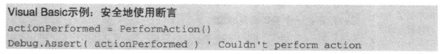

3、用断言来注解并验证前条件和后条件

4、对于高建壮性的代码，应该先使用断言再处理错误。

对于每种可能出错的条件，通常子程序要么使用断言，要么使用错误处理代码来进行处理，但是不会同时使用二者。


### 8.3 错误处理技术

断言是处理程序中不应该出现的错误，那么遇到那些能预料的可能发生的错误时，怎么处理呢？

1、返回中立值。比如计算结果返回0

2、换用下一个有效值。如果函数任务是从一堆数据中找出有效数据的话

3、返回与前次相同的数据。测量得到的数据不准，可以直接返回上一次的测量结果

4、换用最接近的合法值。返回温度范围是0~100，如果测得的是负的，可以直接写0

5、把警告信息记录到日志文件

6、返回一个错误码

7、调用错误处理则程序或对象

8、错误发生时显示错误信息

9、用最稳妥的方式在局部处理错误

10、关闭程序


**健壮性和正确性**

正确性意味着永远不返回不准确的结果。

健壮性意味着要不断尝试采取某些措施，以保证软件可以持续地运行下去，哪怕有时做出一些不准确的结果。

不同场合采取不同的倾向。


**高层次的设计对错误处理方法的影响**

检查函数的返回值。


### 8.4 异常

C++已移除支持，不讨论。

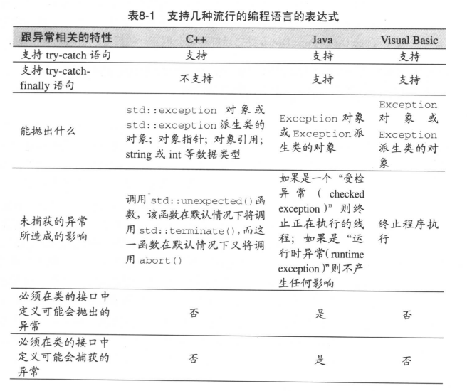

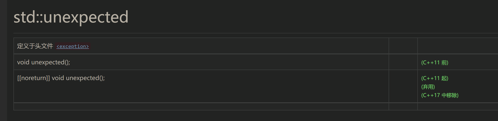


### 8.5 隔离程序，使之包容由错误造成的损害

划出几个类专门用于校验数据，经过检验的数据后续都被认为是可靠的。

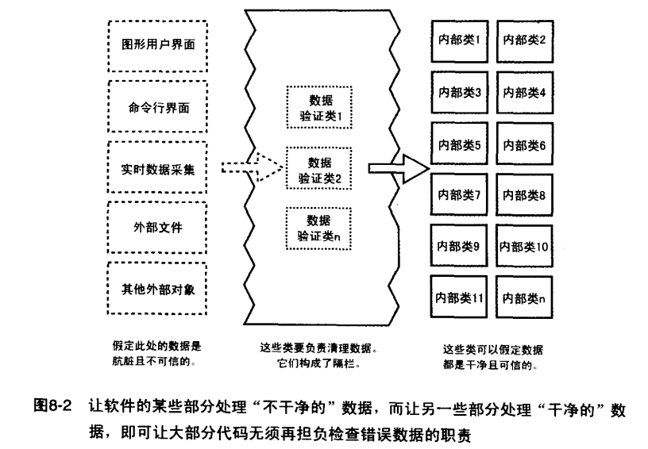


### 8.6 辅助调试的代码

1、在开发期间牺牲一些速度和资源做一些有助于开发、测试的工具、代码是值得的

2、这种测试工具和代码有需要的话尽早做，帮助很大

3、采用进攻式编程：把出错的处理写得尽量严重（比如直接退出程序），这样错误才会被重视并修复

4、计划移除调试辅助的代码：发布前把调试用的测试代码删了


### 8.7 确认在产品代码中保留多少防御性代码

以下是一些保留多少防御性代码的建议：

1、保留那些检查重要错误的代码。

2、去掉检查细微错误的代码。一些无关紧要的错误处理可以注释掉

3、去掉可以导致程序硬件崩溃的代码。用户总是希望在程序崩溃前能保存数据，不要让错误的处理指向崩溃，给他们留点时间。

4、如果在程序崩溃前，你能收集到有用的信息，把这部分收集信息的代码留下来

5、为技术支持收集信息留下通道，比如改变打印等级，获取更高等级的打印

6、不要在程序输出中出现一些不好的、敏感的词汇


### 8.8 对防御式编程采取防御的姿态

防御式编程也会带来问题：

1、让程序臃肿 

2、增肌了代码复杂度

3、防御式编程的代码中可能也存在bug


## 第9章：伪代码编程过程


### 9.1 创建类和子程序的步骤概述

创建一个类可以有多种不同的方式,但一般而言这都是一个迭代过程：

先对 一个类做总体设计,列出这个类内部的特定子程序,创建这些子程序,然后从整 体上复查这个类的构建结果。如图所示

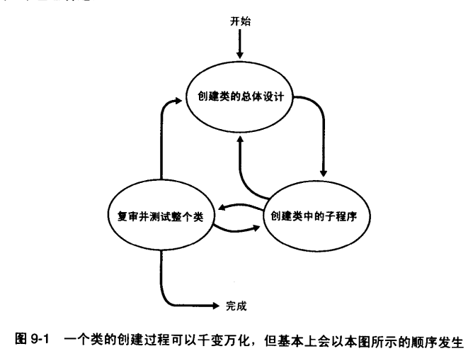

**创建一个类的步骤**

1、创建类的总体设计：定义类的职责、要隐藏的数据、定义接口抽象概念、父类和子类、公用方法、数据成员

2、创建类中的子程序：实现第一步中确定的子程序，这一步骤可能会返过来补充第一步

3、复审并测试整个类：整个类完成后，做下整体的测试，而不是单个子程序的测试


**创建子程序的步骤**

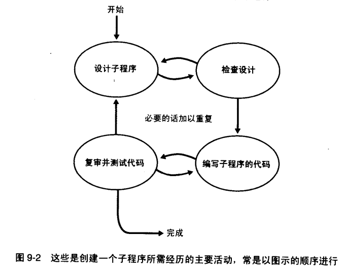


### 9.2 伪代码

描述算法、子程序、类或者完整程序的工作逻辑、非形式的记法，类似于草稿

一些伪代码的建议：

1、用类似英语的语句来精确描述特定的操作。

2、避免使用目标语言中的语法来描述。

3、在意图的层面上编写伪代码，而不是使用目标语言写实现方法

4、在一个足够低的层次上写伪代码（接近用目标代码写，但又不是），这样可以发现更多细节上的困难

伪代码的好处：

1、伪代码方便评审

2、伪代码支持反复的迭代进化

3、设计变化时，修改伪代码比修改真实代码方便

4、伪代码相当于是现成的注释

5、伪代码比其他形式的设计文档容易维护。因为它和代码联系更紧密


### 9.3 通过伪代码编程过程创建子程序

**设计子程序**

1、检查先决条件：这个函数是否有必要

2、定义子程序要解决的问题：明确如下几点

① 子程序要隐藏的信息 

② 各项输入和输出

③ 调用前确保入参的取值在允许范围内或者已经初始化

④ 确保调用的返回数据在允许范围、返回后没有内存泄漏

⑤ 为子程序命名：清晰、无歧义的名字

⑥ 决定如何测试子程序

⑦ 在标准库中找下有没有现成的函数可以用

⑧ 考虑错误处理、考虑效率

⑨ 研究算法和数据类型：翻下算法书有没有可参考的实现

⑩ 编写伪代码、考虑数据类型、检查伪代码


**编写子程序**

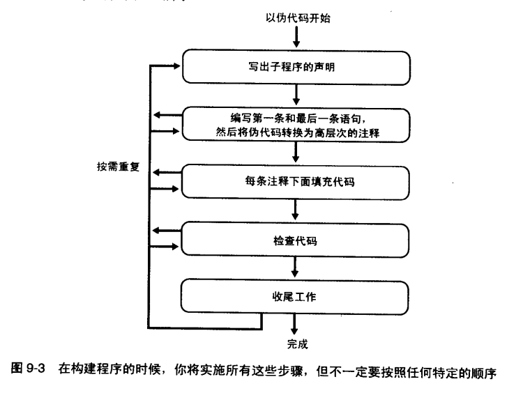

1、写出子程序的声明：函数的头注释

2、把伪代码转成高层次的注释。

3、在每条注释下填充代码

4、检查代码是否要进一步分解：有些步骤代码太长，是否要做成函数


**检查代码**

1、在脑海里检查

2、编译检查

3、在调试器中逐行执行代码

4、测试代码

5、修复错误


**收尾工作**

1、检查子程序的接口：所有参数都用到了吗

2、检查整体的设计质量

3、检查程序变量：变量名是否准确、是否存在未使用的变量、未初始化的变量

4、检查子程序的语句和逻辑、布局、文档

5、去除冗余的注释


### 9.4 伪代码编程的替代方案

1、测试先行开发：写代码前先写测试用例

2、重构：参看第24章

3、契约式设计。参看8.2：用断言来注解并验证前条件和后条件

4、东拼西凑：如果你是这样，那么考虑下本章说的伪代码编程


## 第10章：使用变量的一般事项

### 10.1 数据认知

一些常用的数据类型：

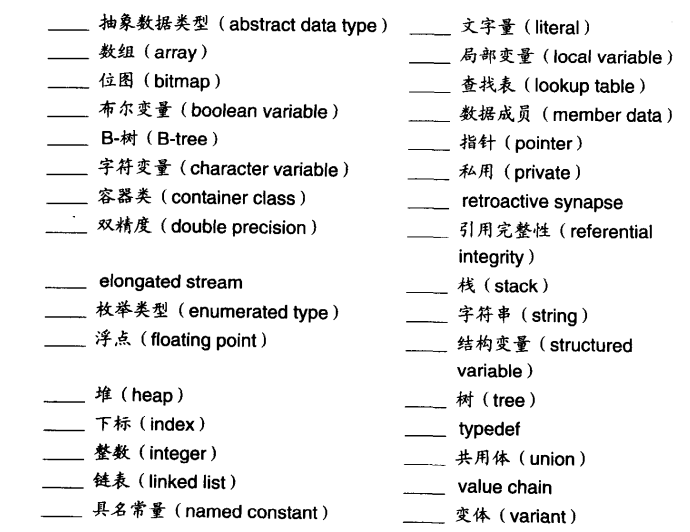


### 10.2 轻松掌握变量定义

有些语言支持隐式变量声明，比如Microsoft Visual Basic中未声明变量时，会自动为你申明改变量。

这样的隐式声明是危险的，会让一些错误无法暴露出来，比如写错了变量名等。

一些建议：

1、关闭隐式声明

2、声明全部变量

3、遵循某种命名规则

4、检查变量名


### 10.3 变量初始化原则

不合理的初始化数据是常见的错误之一。比如：

1、从未对变量赋值。

2、变量值已过期。某个地方赋过值，但现在已不再有效。

3、变量的一部分被赋值，另一部分没有。

一些建议：

1、在变量声明的时候进行初始化。

2、在靠近变量第一次使用的地方初始化它。（针对不支持声明时初始化的语言，且和公司的代码规范有冲突，忽视）

3、理想情况下，在靠近第一次使用变量的位置声明和初始化变量。（和公司代码规范冲突，忽略）

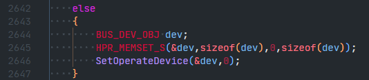

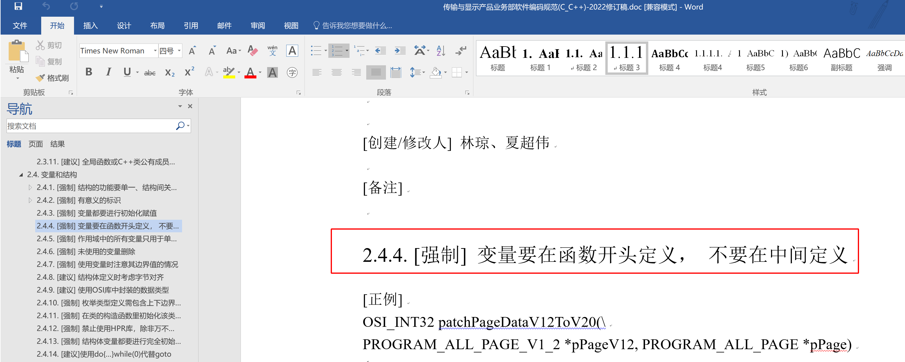

4、在可能的情况下使用final（java）或者const（c++）。这样可以防止在初始化后再被赋值

5、特别注意计数器和累加器。for循环的 i，在下次使用前要再初始化

6、在类的构造函数中初始化该类的数据成员

7、检查是否要重新初始化。比如接收函数返回值的变量

8、一次性初始化具名常量（const修饰的变量）：用可执行代码来初始化变量。在程序开始处对它进行一次初始化就行

9、使用编译器设置来自动初始化所有变量。如果你的编译器支持自动化初始化所有变量的选项，打开它，但不推荐这么做。

10、利用编译器的警告信息

11、检查输入参数的合法性

12、使用内存访问检查工具来检查错误的指针。如果操作系统提供这种服务，或者有第三方工具的话

13、在程序开始时初始化工作内存。


### 10.4 作用域

作用域或者可见性是指变量在程序中的可见和可引用的范围。


**使变量引用局部化**

同一个变量的多个使用代码之间的代码成为攻击窗口（window of vulnerability）。

```c++
int a = 0;
int b = 1;	
int c = 2;
b++;
a++;
c++;
b++;
```

上文中2~4行就是对于a的攻击窗口。因为可能在这里新增代码时可能会错误地修改到a。

那么，怎么衡量这个攻击窗口的大小呢？这里引入**跨度(span)**这个概念：

对上面的例子而言，变量a的跨度就是3，变量b的跨度就是1和2，所以变量b的平均跨度是1.5

尽量缩小跨度，主要的作用是可以增加可读性。


**尽可能缩短变量的存活时间**

存活时间：一个变量存在期间所跨越的语句总数，即：第一次使用到最后一次使用之前跨越的语句总数。（此处不是说这个变量从创建到被销毁的时间）

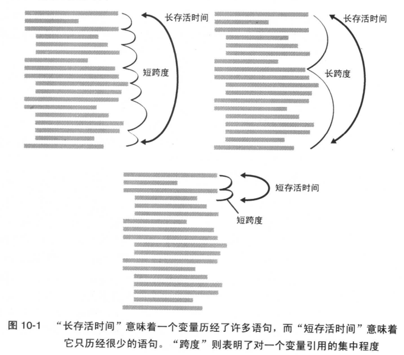

保持尽量短的存活时间也是我们的目标。

这样可以减小攻击窗口、也可以使自己的代码紧凑、更有可读性，更容易拆分成子函数


**减小作用域的一般原则**

1、在循环的开始再初始化循环中使用的变量，而不是在这个循环所在的函数开头

```c++
//不恰当的示范
func1()
{
	int i = 0;
	int b = 1;
		
	b++;
	while(i<10)
	{
		...
		i++;
	}
}
```

```c++
//恰当的示范
func1()
{
	int i ;
	int b = 1;
		
	b++;
    i = 0;
	while(i<10)
	{
		...
		i++;
	}
}
```

2、直到变量即将被使用时再为其赋值。主要是为了快速找到当前变量的值是多少

3、把相关语句放在一起。把操作同一堆数据的函数调用放一起，这样看的时候关注的变量可以少一点

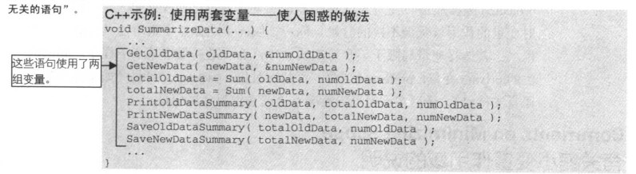

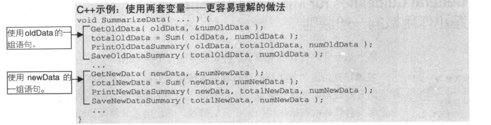

4、把相关语句组提炼成单独的子程序。子程序拥有更短的跨度和存活时间

5、开始时采用最严格的可见性，然后根据需要扩展变量的作用域。

比如最开始都定为private，后续看是否要改为public。从private改为public是简单的，反过来则很困难


**有关缩小变量作用域的说明**

有些人喜欢使用全局变量，这是种偷懒而危险的做法。虽然这很方便，但是会降低可读性，增加危险。


### 10.5 持续性

可以理解为变量从创建到被回收所经历的时间，以下是一些持续性的举例：

1、特定代码段（比如for循环中定义的变量）或者子程序的生命期（局部变量）

```c++
int main(){
      int a,b;//在同个缩进等级内或大于的缩进等级内是能够访问的
      a=10;
      while(a>0){
          int c,d;//在这个缩进内是能够进行访问控制的
          a=a-1;
      }//在这里会销毁 变量c和d
      c = 1;//这里会报错，出了局部变量的作用域
      return 0;
}//在这里会销毁main内定义的所有变量
```

2、只要你允许，它就会持续下去。指程序员自己申请的内存，比如new的内存需要手动delete才会释放

3、程序的生命期。全局变量，static变量等

4、永远持续。保存在数据库、配置文件中的数据，在每次程序起来的时候加载它


为了防止使用的时候变量的值已经不正常了，可以做如下保护：

1、在程序中加入调试代码或者断言来检查那些关键变量的合理取值。

2、抛弃变量后给它赋值为一个不合理的值，比如删除指针后将它指向NULL

3、假设你即将使用的这个变量是没有持续性的。

4、养成在使用所有数据之前声明和初始化的习惯。


### 10.6 绑定时间

绑定时间：把变量和它的值绑定在一起的时间。

绑定的时间点：编写代码时、编译程序时、程序加载时、程序运行时等

采用越晚的时间绑定越有利，虽然复杂度会更高，但灵活性更好


### 10.7 数据类型和控制类型之间的关系

数据一般按下述3种控制方式流动：

1、序列型数据翻译为书序中的顺序语句：也就是顺序执行

2、选择型数据翻译为程序中的``if``和``case``语句

3、迭代型数据翻译为程序中的``for``、``repeat``、``while``等循环结构


### 10.8  为变量指定单一用途

有时候，会有人在一个函数中给一个变量分配2种用途，这样不好。

1、每个变量只用于单一用途：否则会降低可读性

2、避免让代码具有隐含含义：变量``bytesWritten``表示写入文件的字节数，除非它为负数，这种情况下它表示用于输出的磁盘驱动器的号码

3、确保使用了所有已声明的变量


 ## 第11章：变量名的力量


### 11.1 选择好变量名的注意事项

最基础的，不要随便取名字，比如xx、xxx这样不知道什么意思的变量名。

**最重要的命名注意事项：**该名字要完全、准确地描述出该变量所代表的事物。

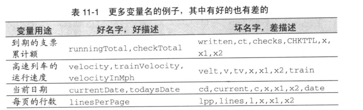

**以问题为导向：**一个好名字通常表达的是“什么”，而不是"如何"，比如一条员工数据记录，应该取名为employeeData，而不是inputRec


**最适合的名字长度：**不要太长（难写难读）也不要太短（信息不够），在9~15，或者10~16个字符最好。


**变量名对作用域的影响：**

1、一般程序员看到``i``这样的变量，都知道它只是个临时变量，作用域不会很大。

较长的名字适合用于很少用到的变量或者全局变量，较短的名字适用于局部变量或者循环变量

2、对位于全局命名空间中的名字加以限定词。这样可以避免命名冲突

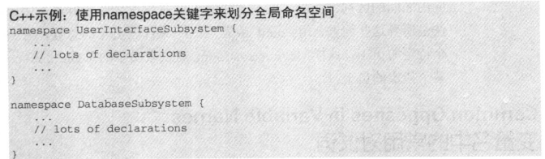


**变量名中的计算值限定词**

比如，在考虑给页码总数取变量名时，在``pageTotal``和``totalPage``之间，应该选择``pageTotal``，因为：

① 应该把变量中重要的部分放前面   ② 做了这样的规定之后变量命名会更整齐


**变量名中的常用对仗词**

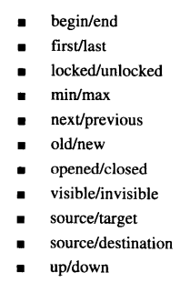、


### 11.2 为特定类型的数据命名

为循环变量、状态变量、临时变量、布尔变量、枚举类型和具名常量命名有关的注意事项。


**为循环下标命名**

``i``、``j``、``k``这样的循环下标仅适用于简单循环。复杂循环的话，还是需要为下标取名。

比如``score[teamIndex] [eventIndex] ``要比 ``score [i] [j]``给出的信息更多。


**为状态变量命名**

为状态变量取一个比`flag`更好的名字。状态也使用枚举或者宏来取代数字。

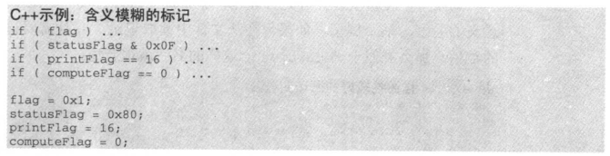

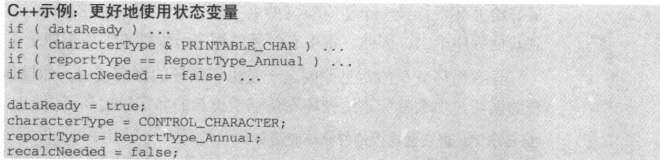


**为临时变量取名**

一般临时变量都取名为`tmp`、`x`等。

但临时变量可能是不必要的，只是偷懒没有搞清楚它到底是拿来干什么的，等你搞清楚的时候，也应该给它们取名。


**为布尔变量命名**

常用的布尔变量名：`done`、`error`、`found`、`success`或`ok`，这些次都是隐含了**“真/假”**含义的名字。

也有些人喜欢在布尔变量名前面加上Is，对我们公司而言，则是加上b，比如`bSuccess`。

注意使用肯定的布尔变量名更容易理解，比如`bSuccess`比`bNotSuccess`要容易理解。


**为枚举类型命名**

在使用枚举时，可以通过增加前缀，来明确表示该类型的成员同属于一个组

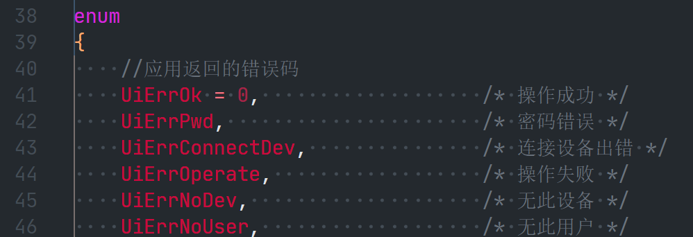


**为常量命名**

常量命名应该表达它的含义，而不是表达它的数值

```c++
const int pageMax = 100;	//合适的
const int hundred = 100；    //不合适的
```


### 11.3 命名规则的力量

**为什么要有规则：**

1、有了规则之后可以按规则办事，而省去自己做决定的时间

2、有助于在项目间传递知识。名字的相似性让你更容易、更自信地理解那些不熟悉的变量是什么意思

3、有助于在新项目中更快的学习代码

4、有助于减少名字增生：比如为了表示总点数，没有规则的情况下会出现`pointTotal`和`totalPoint`两个变量

5、弥补编程语言的不足之处。如果不支持枚举，完全可以通过命名多个常量来模拟


**何时采用命名规则**

1、当多个人开发一个项目时

2、当你计划把一个程序转交给另一个程序员来维护时

3、当你所在的组织中的其他程序员评估你写的代码的时候

4、当你写的程序规模太大，以致你无法在脑海中同时了解事情的全貌，而必须分而治之的时候（多个模块保持一样的风格）

5、你写的程序开发周期很长，可能你放了一段时间后还需要再来开发它

6、当一个项目中存在一些不常见的术语，希望开发的时候统一该用什么名称和缩写


**正式程度**

根据具体情况而言，一般程序规模越大，参与人员越多，需要实施越严格的规则。


### 11.4 非正式命名规则

大部分项目使用的都是非正式的命名规则


**与语言无关的命名规则的指导原则**

**区分变量名和函数名：**变量名以小写字母开始，函数名以大写字母开始。（公司的规则是只有对外的函数名以大写字母开头）

**区分类和对象：**有多种方法

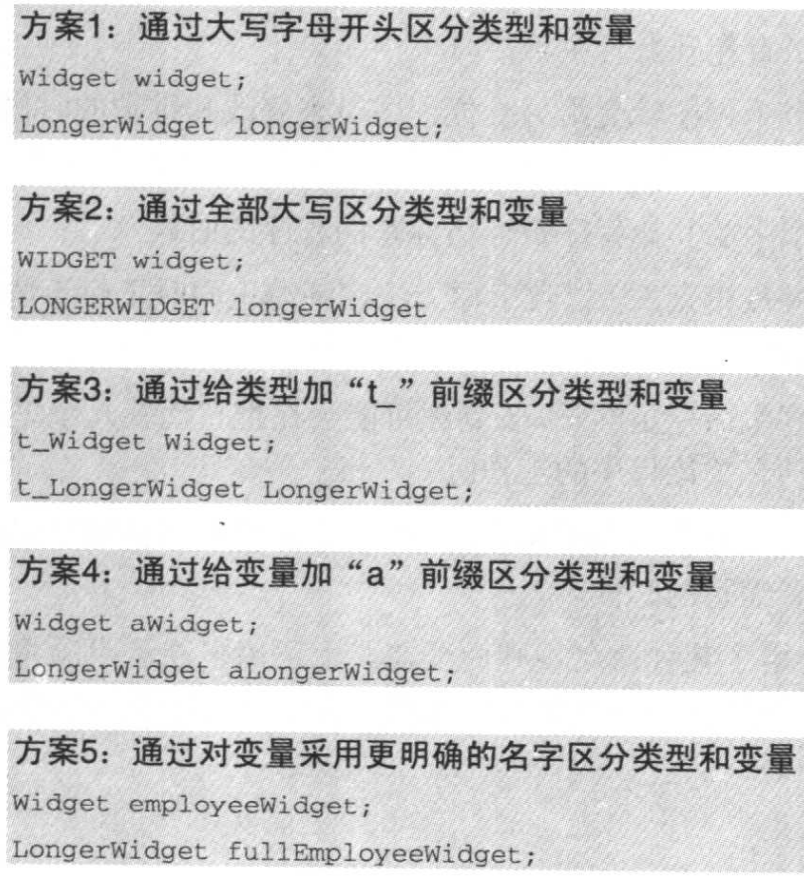

**标识全局变量：**在全局变量名前加`g_`

**标识成员变量：**在成员变量前加`m_`

**标识类型声明：**C++的惯用方法是把类型名全部用大写，也可以为类型名增加`t_`前缀

**标识具名常量：**常用的方法是增加`c_`的前缀，C++的规则是全部用大写

**标识枚举类型的元素：**标准方法是全部用大写，或者增加`e_`或者`E_`的前缀

**在不能保证输入参数只读的语言里标记只读参数：**C++中为只读参数增加`const`

**格式化命名以增加可读性：**用大小写和分隔符来分割单词。比如将`totalpagefordamadaquan`可以写成`totalPage_for_daimadaquan`


**与语言相关的命名规则的指导原则**

**C的命名规则**

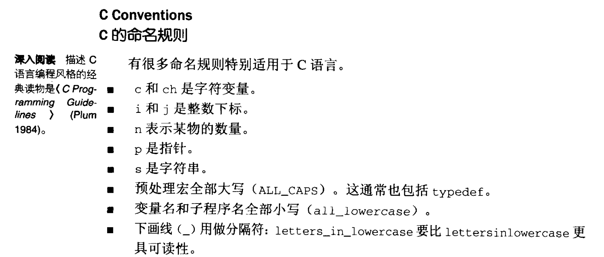


**C++命名规则**

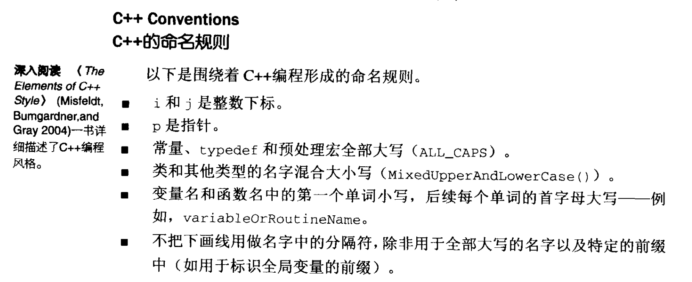


**混合编程语言的注意事项**

如果使用多种语言编写一个程序，需要在上面的基础上再新增一些规则，或者把矛盾的统一一下


**命名规则示例**

一些示例，此处不做展示了，还是以公司的建议为准


### 11.5 标准前缀

对具有通用含义的前缀标准化，为数据命名提供了一种简洁、一致并且可读性 好的方法。有关标准前缀最广为人知的方案是匈牙利命名法，该方案由一组用于指 导变量和子程序命名（而不是指导如何给匈牙利人取名！）的详细原则组成，并且 曾经一度被广泛用于 Microsoft Windows 编程。尽管目前匈牙利命名法已经不再得到 广泛使用，但是使用简洁准确的缩写词的基本命名标准理念却仍然具有价值。

标准化的前缀由两部分组成:用户自定义类型(UDT)的缩写和语义前缀。


**用户自定义类型缩写（UDT）**

UDT用于标识**数据类型**

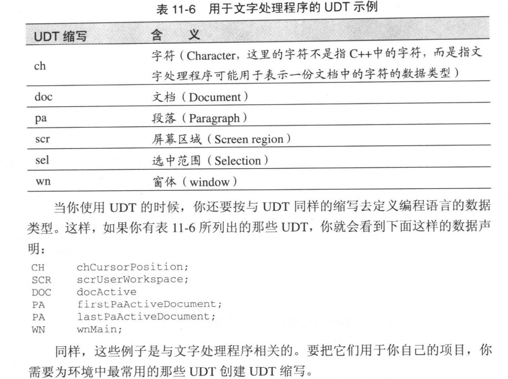


**语义前缀**

语义前缀标识变量或者对象是**如何使用**的。

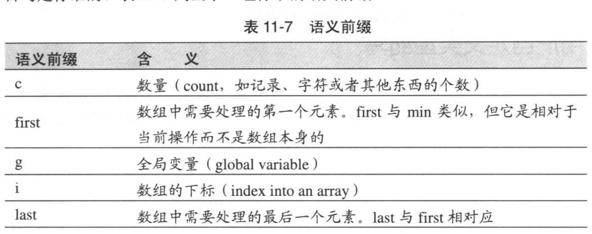

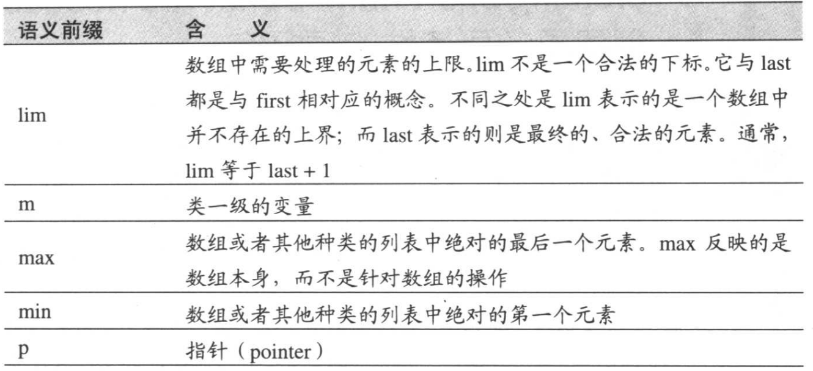

语义前缀可以和UDT组合使用，比如第一个段落就可以写成`firstPa`


**标准前缀的优点**

1、由于很多名字都标准化了，所以你在程序中需要记忆的名字更少了。（真的吗？记UDT和语义前缀的表格也很累啊:sweat_smile:）

2、让变量更紧凑，比如`cpa`表示的就是`totalParagraphs`

3、当你看到两个不同UDT的变量之间相互赋值的时候，你可以一眼看出是错误的


### 11.6 创建具备可读性的短名字

虽然C++对名字长度没有限制，但是还是短名字更好一些，下面是一些建议：


**缩写的一般指导原则**

有些是相互冲突的，视情况选择使用

1、使用标准的缩写（公认的或者字典上的）

2、去掉所有非前置元音。（太专业了，忽略:joy:）

3、去掉虚词and、or、the等

4、使用每个单词的第一个或者前几个字母

5、统一的在每个单词的第一、第二或者第三个字母后截断

6、保留每个单词的第一个和最后一个字母

7、使用名字中的每个重要单词，最多不超过3个

8、取出无用的后缀，比如`ing`、`ed`

9、保留每个音节中最引人注目的发音

10、确保不要改变变量的含义

11、反复使用上面的技术，把字符长度控制在8~20个之间


**语音缩写**

比如把`before`写成`b4`，把`to`写成`2`


**有关缩写的评论**

一些避免犯错的规则：

1、不要用从每一个单词中删除一个字符的方式来缩写。写一个字母并不费劲

2、缩写要一致。要不全用`Num`，要不全用`No`

3、创建你能读出来的名字。用`needsCompu`而不是`ndsCmptg`

4、避免使用容易看错或者读错的字符组合。比如表示B的结尾，用`ENDB`比`BEND`更好

5、使用辞典来解决命名冲突。推荐一个网站：[CODELF](https://unbug.github.io/codelf/)

6、在代码里用缩写对照表来解释极短的名字的含义。

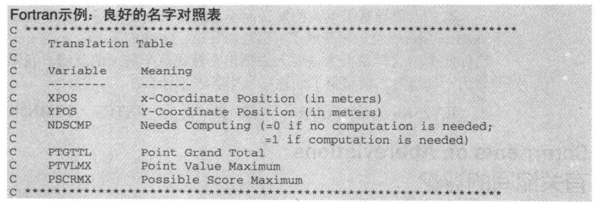

7、在一份项目级的“标准缩写”文档中说明所有缩写

8、记住，名字对于阅读者比作者更重要。


### 11.7 应该避免的名字

1、避免使用令人误解的名字或缩写。比如`FALSE`一般表示错误，如果你把它当做Fig and Almond Season的缩写就不合适了

2、避免使用具有相似含义的名字。比如在一个函数中使用`input`和`inputValue`，这两个变量名太相似了，让人不知道有什么差别

3、避免使用发音相似的变量。比如`wrap`和`rap`，对我们中国人而言可能不是问题?:thinking:

4、避免在变量中用数字。比如用数字区分两个变量`file1`和`file2`

5、避免在名字中拼错单词。

6、避免使用英语中尝尝拼错的单词。

7、不要仅靠大小写拉区分变量名。

8、避免使用多种自然语言。比如一会儿用英语给变量命名，一会儿用日语给变量命名

9、避免使用标准类型、变量和子程序的名称。

10、不要使用与变量含义完全无关的名字。

11、避免在名字中包含易混淆的字符。

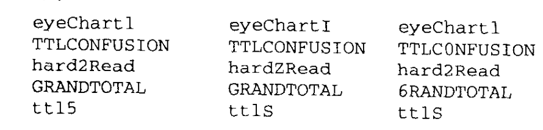


### 11.8 部门的变量命名规则

[《传输与显示产品业务部软件编码规范(C_C++)-2022修订稿.doc》](https://192.0.0.183/Transmission-Share/共享资料库/小组/软件组/团队建设/能力建设/02专题学习/L1-04 代码大全/2022面向新人整合版课件/传输与显示产品业务部软件编码规范(C_C++)-2022修订稿.doc)

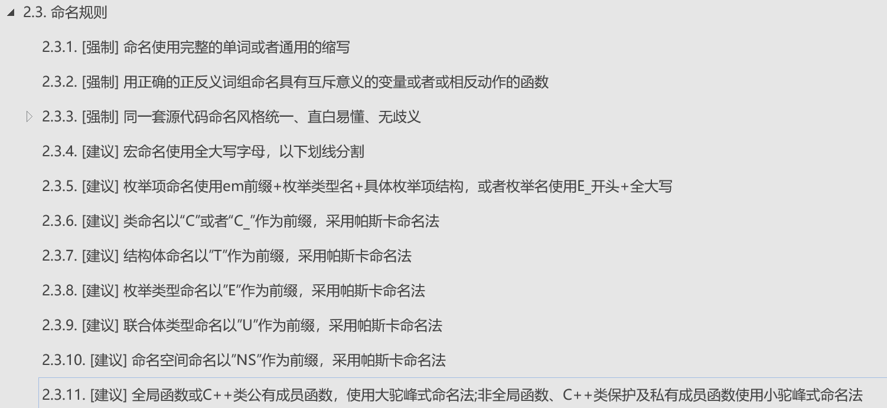


## 第12章：基本数据类型


### 12.1 数值概论

1、避免使用“神秘数值”（指看不出含义的数字）。如果你的语言支持具名常量，可以用它来代替数字。

避免使用神秘数字的好处：

​	① 修改会变得可靠。修改宏而不是修改多个数字，避免遗漏

​	② 修改会变得容易。

​	③ 代码可读性更高

2、如果需要，可以使用硬编码的0和1。一条原则是：程序中仅能出现的文字量就是0和1，其他的文字量应该都用更有描述性的表示

3、预防除零错误。

4、使类型转换变得明显。

```c++
y = x + (float)i;
```

5、避免混合类型的比较。比如拿整型和浮点型比较

6、注意编译器的警告。最好消除编译器的所有警告


### 12.2 整数

使用整数的注意事项：

1、检查整数除法。7/10 不等于0.7，而是0

2、检查整数溢出。做整数乘法或加法时，要注意结果是否溢出

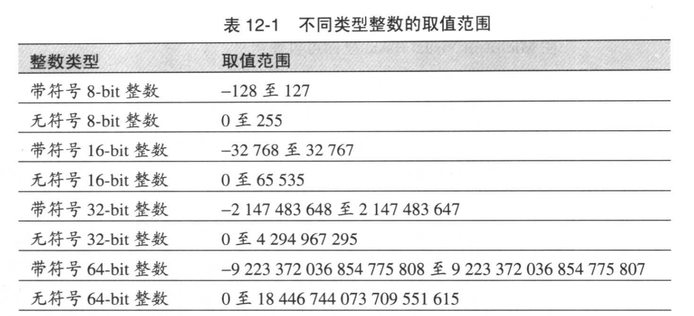

3、检查中间结果溢出。

```c++
int a = 1000000;
int b = 1000000;	
int c = a * b / 1000000;	//a * b 已经溢出了
```


### 12.3 浮点数

浮点数的主要问题是像1/3这样的无限循环小数通常只用7位或者15位精度，这种不精确可能带来麻烦。

以下是一些使用浮点数时应该遵循的原则：

1、避免数量级相差巨大的数之间的加减运算。

2、避免等量判断。

浮点型不要拿来判断相等，但是可以拿来<、>、>=、<=，所以事先定一个可以接受的误差范围，然后判断在这个误差范围内则认为相等。

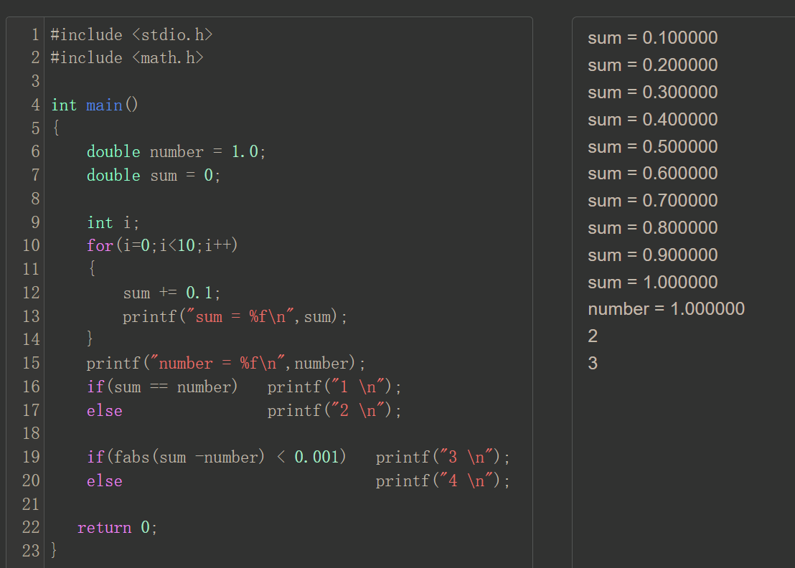

3、处理舍入误差问题。四舍五入导致的误差

一些常见的方案：

​	① 换精度更高的变量类型，比如float换成double

​	② 换用二进制编码的十进制变量。

​	③ 把浮点变量你变成整型变量。比如把3.1415扩大10000倍，变成31415后做整型运算

4、检查语言和函数库对特定数据类型的支持。如果你的语言有专门的机制处理这个问题，可以使用它


### 12.4 字符和字符串

本节给出一些使用字符串的技巧，其中第一条适用于所有语言：

1、避免使用神秘数字和神秘字符串。原因如下：

​	① 一些文字经常要用到，定义成宏会更方便

​	② 为了做多语言版本，需要将需要翻译的内容放到配置文件等地方，而不是直接写在代码中

​	③ 字符串的字面表示形式通常都会占用较多的存储空间。

​	④ 字符和字符串的表面形式是含糊的，而宏可以为此做注释

```c++
if( input_char == 0x1B)
if( input_char == ESCAPE)
```

2、避免off-by-one错误。也就是读写字符串的时候下标偏差1

3、了解你的语言和开发环境是如何支持Unicode的。注意不同模块间字符编码格式之间的转换

4、在程序生命期中尽早决定国际化/本地化策略。国际化意味着多语言版本，需要将字符串做成配置文件还是其他的方式

5、如果你知道只需要支持一种文字的语言，请考虑使用ISO 8859字符集。（对于外国人而言）

6、如果你需要支持多种语言，请使用Unicode

7、采用某种一致的字符串类型转换策略。程序使用同一种格式，尽可能在靠近输入和输出的地方做字符串格式转化


**C语言中的字符串**

C++的string类已经修复了C字符串的很多问题，我们来看下C的字符串有哪些问题：

1、注意字符串指针和字符数组之间的差别：

​	① 警惕任何包含字符串和等号的表达式。

​	因为像strcmp之类的函数都是把字符串作为参数传入，如果你看到 “指针 =  xxx ”的表达式，很可能是错误

​	② 通过命名规则区分变量是字符数组还是字符串指针。

2、把C-style字符串的长度声明为CONSTANT+1。为结束符预留空间

3、用null初始化字符串以避免没有终端的字符串。

4、用字符数组取代C中的指针。有助于避免指针错误，并且编译器也会给更多的警告

5、用`strncpy`取代`strcpy`以避免无终端的字符串。


### 12.5 布尔变量

**一般布尔变量很少用错，下面是一些建议**

1、用布尔变量对程序加以文档说明。你可以把一个表达式的结果赋值给一个布尔变量，再给这个布尔变量取名，增加可读性

```c++
int i = 0,b = 1;
bool zhengShu = (i > 0 && b > 0);
if(zhengShu) .......
```

2、用布尔变量来简化复杂的判断。要是上面的`if`中判断条件很多，用多个布尔变量可以增加可读性

3、如果需要的话，创建自己的布尔类型。C语言没有`bool`类型，你可以自己创建一个

```C
typedef int BOOLEAN;
enum Boolean	//或者这样
{
	FALSE=0,
    TRUE,
};
```


### 12.6 枚举类型

枚举的好处是说明性更强，不用像 “1代表红色、2代表绿色”这样写很多注释，而是用枚举的名字`COLOE_RED`就能看出意思。

**下面是一些如何使用枚举类型的指导原则：**

1、用枚举来提高可读性。

```C
int color = 1; 			//不使用枚举
int color = COLOR_RED;	//使用枚举
```

2、用枚举来提高可靠性。

```c
enum color
{
	COLOR_RED,
	COLOR_BLUE,
};

enum digital
{
	DIGITAL_ONE,
	DIGITAL_TWO,
	DIGITAL_THREE,
};

enum color c;
c = COLOR_RED;		//正确
c = DIGITAL_ONE;	//报错
c = 3;			    //报错
```

3、用枚举来简化修改。只改枚举一个地方就行

4、将枚举类型作为布尔变量的替代方案。枚举是布尔变量的一种扩展

5、检查非法数值。如果你`if else`或者`case`遍历枚举的情况，记得处理`else`和`default`

6、定义出枚举的第一项和最后一项，以便用于循环边界

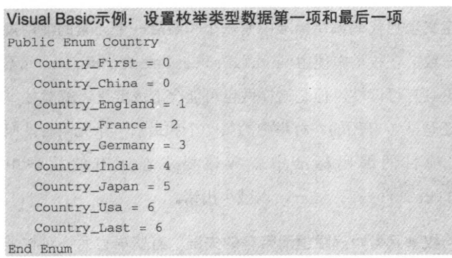

7、把枚举类型的第一个元素留作非法值。比如错误码的枚举，第一个是代表正常的

8、明确定义项目代码编写标准中第一个和最后一个元素的使用规则，并且在使用时保持一致。

​	比如上图有2个0，2个6，循环的时候该拿哪个判断呢？顶一个规则

9、警惕给枚举元素明确赋值带来的失误。

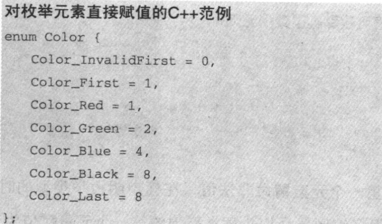

像上图中的枚举，就不能在循环中被用作数组下标


如果你的语言中没有枚举变量：C/C++支持，此节跳过


### 12.7 具名常量

一旦赋值后就不能再修改。

```c
#define MAX 100
const int MAX = 100;	
```

1、在数据声明中使用具名常量

```c
const int LEN_MAX = 100;
char name[LEN_MAX+1];
```

2、避免直接使用数字，即时是安全的。

```c
int i;
for(i = 0; i < 12; i++)		//12是什么意思呢
```

3、用具有适当作用域的变量或者类来模拟具名常量。 C/C++本身支持具名常量，此处忽略

4、统一地使用具名常量。不要一会用`char name[LEN_MAX+1]`，一会用`char name[100]`


### 12.8 数组

**一些使用数组的建议**

1、确认所有的数组下标都没有超出数组的边界。

2、考虑用容器来取代数组，或者将数组作为顺序化结构来使用。

​	比如C++的`vector`、`list`等，一些人建议不要随机访问数组，只能顺序地访问数组。但随机访问不是数组的优点吗？:thinking:

3、检查数组的边界点。说到底和第一条一样

4、如果数组是多维的，确认下标的使用顺序是正确的。

5、提防下标串话。两个`for`循环的时候把`i`和`j`搞错的情况

6、在C中结合`ARREY_LENGTH()`宏来使用数组

```c
#define ARRAY_LENGTH( x ) (sizeof(x)/sizeof(x[0]))		//用于计算数组包含的成员个数
```


### 12.9  创建自己的类型（类型别名）

比如要定义一个变量表示海拔，你起先觉得需要`double`才够精确，但客户说只要`float`就行了，

你担心后续客户会改需求，又改成double，那么，你可以使用`typedef`创建自己的类型来解决

```C
typedef float Coordinate;	//坐标的意思

Coordinate x = 1.234;
```

**创建自己的类型的好处：**

1、易于修改。

2、避免过多的信息分发。

3、增加可靠性。举例是Ada，C/C++不理解

4、弥补语言的不足。比如C中自定义类型模拟布尔类型


**创建自己的类型的一些指导原则：**

1、给创建的类型取功能导向的名字。比如上文中的`Coordinate`而不是定义成`myFudian`，再比如布尔类型的`BOOLEAN`

2、不要重定义一个预定义的类型。比如你又`typedef`了一个``int`

3、定义替代类型以便于移植。

​	比如你定义了一个`INT32`类型，用它代替`int`，用`LONG64`类型来代替long。当你移植平台后，你可重新定义

​	`INT32`和`LONG64`所替换的对象，改成该硬件平台下的类型。

4、考虑创建一个类而不是使用`typedef`


## 第13章：不常见的数据类型

介绍除12章之外的数据类型


### 13.1 结构体

C和C++的`struct`，有时候类和结构体很像（在类没有成员函数的时候）。有些人倾向于使用类，因为私密性和功能性更好，

但结构体也有它的优点，比如：

1、用结构体来明确数据关系。使用结构体把一堆数据包在一起，再取一个结构体名，解释了他们之间的联系

2、用结构体简化对数据块的操作。

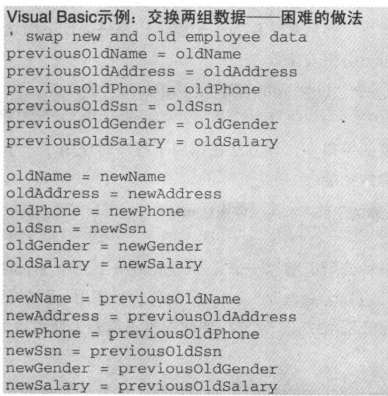

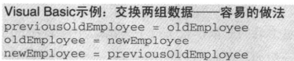

3、用结构体来简化参数列表。传一个结构体指针，而不用传所有结构体成员

4、用结构体来减少维护。那些和结构体没有关系的代码在修改结构体时不会受到影响


### 13.2 指针

指针很容易出错。


**用来理解指针的范例**

1、内存中的位置。

内存中的一个位置就是一个地址。在32位处理器中就是一个32位的值（4字节）。指针变量中存的就是这样一个4字节的地址。

想要使用指针指向的数据，就必须访问该地址。

2、如何解释指针所指的内容

看指针的类型，这个类型决定了指针取地址后的多少大小并解释成哪种类型


**使用指针的一般技巧**

指针错误一般都产生于指针指向了它不应该指向的位置，修改了该位置的数据造成**内存破坏**。

我们需要尽量避免造成指针错误，并且采取一些额外措施使得错误能被发现。下面是一些建议

1、把指针操作限制在子程序或者类中。把操作指针的行为写到一个函数里，可以防止你的程序中到处是指针操作，减小犯错的概率。

2、同时声明和定义指针。 也就是声明的时候就给指针赋值成`NULL`

3、在与指针分配相同的作用域内删除指针。比如你在一个子程序中分配了指针，就该在退出子程序前释放指针

4、在使用指针之前检查指针。先判空再使用指针

5、先检查指针所引用的变量再使用它。比如指针指向的是一个最大100字符的字符串，判空后可以先`strlen`看下它的长度是否超过了100

6、用狗牌字段来检测损毁的内存。

​	比如你只需要申请100个字节，但你申请104个字节，前4个字节存放一个约定的数值作为狗牌。然后仅使用后面的100个字节

​	当你需要free时，先看下狗牌上是不是那个约定的数值，是的话104个字节全释放，否则的话认为已经释放过了，不要重复释放。

7、增加明显的冗余。和狗牌一样的机制

8、用额外的指针变量来提高代码清晰度。和**不要用一个变量代表两个意思**一样，可以用多个指针来增加可读性

9、简化复杂的指针表达式。如果有一个很复杂的指针取值操作，比如a->b->c，那么用一个变量接收它，后续用这个变量

```c
int number = a->b->c;
```

10、画一个图。 画图解释指针指向

11、按照正确的顺序删除链表中的指针。错误的删除会导致有些指针指向的内存无法释放

12、分配一片保留的内存做后备区域。防止你的程序忽然用尽了内存导致无法收尾，此时可以释放这部分后备内存用于收尾工作

13、粉碎垃圾数据。在释放内存前将内存清空

14、在删除或者释放指针之后把它们设置为空值。释放指针后把指针指向NULL。

15、 在删除变量之前检查非法指针。在`free`指针之前先判断指针是否为NULL，避免重复释放

16、跟踪指针分配情况。建一个表和一个查询表的函数，用以释放指针，释放指针后就把它从列表中删除

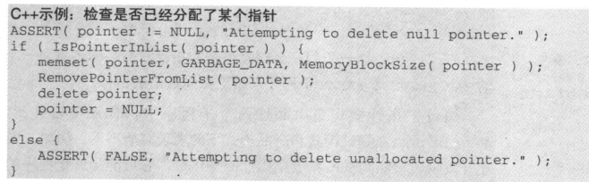

17、编写覆盖子程序，集中实现避免指针问题的策略。比如使用SAFE_NEW和SAFE_DELETE宏

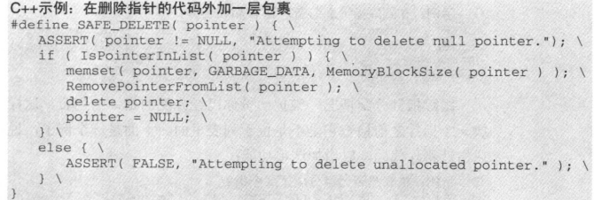

18、采用非指针技术。指针容易出错，可能的话使用别的技术


**C++指针**

1、理解指针和引用之间的区别。在C++中，指针（*）和引用（&）都能够间接地引用对象。

```c++
int a = 2, &ra = a;	//ra是a的引用
int *pa = &a;		//pa是a的指针
ra++;			   //a = 3
*p += 1;		   //a = 4
```

​	引用和指针的差别是，引用必须得有一个对象，而指针是可以指向空的。

2、把指针用于“按引用传递”参数，把`const`引用用于“按值传递”参数。

​	如果直接传参数（而不是指针或引用），函数需要创建一个变量并拷贝入参，这样比较耗时。传指针和引用的话就省去了这部分操作。

​	但是，如果我想要求传入的值不被修改呢？（直接传值就不会被修改），可以给引用加上`const`关键字

```c++
int func(int *pa, const int &ra);	//pa指向的内容可修改，ra引用的对象不可修改
```

​	实际上指针也可以指定指向的内容不可修改

```c++
const int *pa;	//指向整型常量的指针，它指向的值不能修改
int * const pa;	//指向整型的常量指针，它不能指向别的变量，但它指向的变量的值是可以变的
//所以这样也是可以的
int func(const int *pa,const int &ra);	//pa和ra指向的内容都不能修改
```

3、使用`auto_ptr`。（已在C++11中废弃并在C++17中正式从`STL`移除）

大概的意思是，调用`auto_ptr`类申请指针，在`auto_ptr`类的构造函数里会申请内存，它的析构函数会释放内存。

因此你不需要关心释放内存的事。

```c++
void demo()
{
	auto_ptr<double> apd(new double);
	*apd = 25.5;
}
```

但是会存在安全问题，比如下面`p1`和`p2`都指向同一块内存，到时候它们的析构函数都执行一遍，会重复释放内存。

```c++
void demo()
{
	auto_ptr<double> p1(new double);
	auto_ptr<double> p2;
	p2 = p1;
}
```


4、灵活使用智能指针。

参考文章：

[智能指针类模板：auto_ptr、unique_ptr、shared_ptr的原理与使用]([智能指针类模板：auto_ptr、unique_ptr、shared_ptr的原理与使用_智能指针模板-CSDN博客](https://blog.csdn.net/baidu_38797690/article/details/131355601))


**C指针**

1、使用显式指针类型而不是默认类型。分配内存的时候显式地告诉接收方申请的类型，方便编译器检查

```c++
double *p = (double *)mallco(sizeof(double));
```

2、避免强制类型转换。

3、遵循参数传递的星号规则。正确的语法


### 13.3 全局数据

使用全局数据的风险比使用局部数据大。

常见的问题：

1、无意间修改了全局数据

2、与全局变量有关的奇异和令人激动的问题。

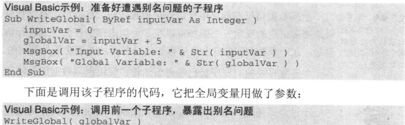


因为程序调用时把`globalVal`赋值给了`inputVar`，所以它们实际上是一个值

3、与全局数据有关的代码重入问题。包含全局变量的函数一般是不能重入的

4、全局变量阻碍代码重用。移植函数到别的项目上会很困难

5、与全局数据有关的非确定性的初始化顺序事项。如果你初始化一个全局变量的时候是用了另一个全局变量，不能保证它是已经被初始化了的。

6、全局数据破坏了模块化和智力上的可管理性。破坏模块化，难以跟踪理解


**使用全局数据的理由**

如果遵循如下的原则，那么全局变量在一些场合也是有用的。

1、保存全局数值。一些概念上用于整个程序的数据

2、模拟具名常量。`const`修饰 全局变量，因为不会修改，所以也好理解

3、模拟枚举类型。python等不支持枚举的语言可用

4、简化对极其常用的数据的使用。如果好多函数都需要某个参数，可以把这个参数提成全局变量

5、消除流浪数据。如果有一个变量需要通过N个程序透传到最终的程序，可以把它提成全局变量


**只有万不得已时才使用全局变量**

一些替代方案：

1、首先把一个变量设成局部的，仅当需要的时候才把变量设置成全局

2、区分全局变量和类变量。类变量也可以在类的成员函数内被访问，要思考下是不是用类变量就可以了


**用访问器子程序来取代全局数据**

访问器子程序的优势

1. 你获得了对数据的集中控制
2. 你可以确保对变量的所有引用都得到了保护
3. 自动获取信息隐藏的普遍益处
4. 访问器子程序可以很容易转变为抽象数据类型

如何使用访问器子程序：

1. 要求所有的代码通过访问器子程序来存储数据：比如，所有全局以g_开头，除了访问器，其他代码都不得访问
2. 不要把所有的全局数据都扔在一处：尽量把全局数据和访问器子程序打包到适合的类里面
3. 用锁定来控制对全局变量的访问：锁定要求使用或者更新一个全局变量值之前，该变量必须被签出，完成使用之后再签入。（加锁）
4. 在访问器子程序里构建一个抽象层
5. 对一项数据的所有访问都应该在同一个层次上（操作一致性）

降低全局数据的风险

1. 创建一种命名规则来突出全局变量
2. 为全部的全局变量创建一份注释良好的清单
3. 不要用全局变量来存放中间结果
4. 不要把所有的数据都放在一个大对象中并导出传递，以说明你没有使用全局变量


## 第14章：组织直线型代码

本章介绍最简单的控制流：即按先后顺序放置语句和语句块


### 14.1 必须有明确顺序的语句

指那些必须按照某些顺序执行的语句。有前后依赖关系的语句。

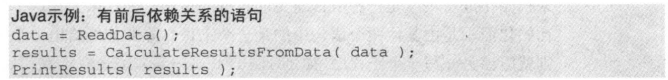

但是也有一些写法，使得这种依赖性被隐藏起来了。

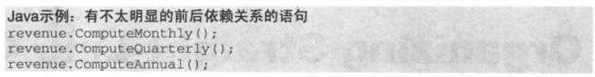

比如上面这种，需要知道季度的数据需要在月度数据算出来之后才能算出，否则就看不出这几行之间有什么依赖性。

或者，一个初始化成员变量的函数和一堆填充成员变量的函数，也有隐藏的先后关系，即：先初始化，再填充。


下面是一些让依赖性更明显的建议：

1、**设法组织代码，使依赖性更明显。**比如成员变量初始化，是否可以写到各自赋值的子函数开头，或者把初始化函数名字取得更明显`initializeExpenseData`

2、**使子程序名更凸显依赖性。**尽量在子程序名字中体现出它的全部功能

3、**利用子程序参数明确显示依赖关系。**如果第二行的入参是第一行修改过的，那他们肯定是有依赖性的

4、**用注释对不明晰的依赖性进行说明。**

5、**用断言或者错误处理代码来检查依赖性。**比如在构造函数中设置一个成员变量`isInit`标识是否已经完成初始化，后续使用到成员变量前都先判断一遍它


### 14.2 顺序无关的语句

有时候一些语句前后并没有顺序关系，它们没有依赖性，但是顺序的确对可读性、性能和可维护性有影响，这个时候怎么决定它们的顺序呢？

你可以使用第二标准来判断语句或者代码的顺序。这其中的指导原则就是**就近原则**：把相关的操作放在一起


**使代码易于自上而下地阅读**

自上而下的顺序对提高可读性最有帮助。

```c++
//不好的例子
int a;
int b;
int c;

a = 1 + 1;
b = 2 + 2;
c = 3 + 3;

//好的例子
int d;
d = 4 + 4;

int e;
e = 5 + 5;
```


**把相关的语句组织在一起**

如果一些语句处理了相同的数据、执行了类似的任务，或者有某种执行顺序上的依赖关系，把他们放在一起。

检查办法：把子程序打印出来，然后在相关的语句上画上框。


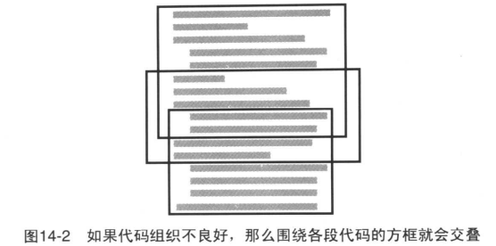


## 第15章：使用条件语句

条件语句用来控制其他语句是否执行：其他语句在`if`、`else`、`case`、`switch`等语句里时变为有条件执行。


### 15.1 if语句


**简单`if then`语句**

一些指导原则：

**1、首先写正常代码路径；再处理不常见情况** ：写代码时，让正常情况的代码路径尽量清晰

**2、确保对于等量的分支是正确的**：不要用`>`代替`>=`，或者使用`<`代替`<=`，以避免off-by-one（下标偏差）错误

**3、把正常情况的处理放在`if`后面而不是放在`else`后面**。

**4、让if子句后面跟随一个有意义的语句**：`if`的执行语句不要为空，会很奇怪

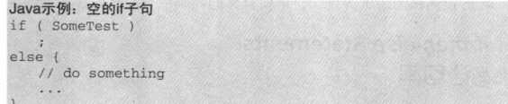

**5、考虑`else`子句**：就算你只需要一个`if`，不需要`else`，你也可以写一个空语句，表示你考虑过了，并注释为什么不需要处理

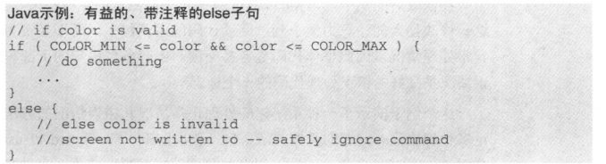

**6、测试else子句的正确性**：测试中应该包含异常情况的测试

**7、检查if和else语句有没有弄反**：一个编程中常见的错误


**`if-else if` 语句串**

一些指导原则：

**1、利用布尔函数调用简化复杂的检测**：`if`的判断内容不要太复杂，如果太复杂，就提成一个布尔函数

**2、把最常见的情况放在最前面**：这样方便阅读，也更有效率（因为正常情况一般是最常出现的）

**3、确保所有的情况都考虑到了**：在最后一个`else`子句里，用出错消息或者断言来捕捉那些你不考虑的情况

**4、如果你的语言支持，用别的语句串替换成其他结构**：比如`case`一样，因为他们更容易编写和阅读


### 15.2 **case语句**

不同的语言对`case`的支持不同，比如C++只支持在`case`中使用有序数类型（整数）

下面是如何有效使用`case`的一些建议

**1、为case选择最有效的排列顺序**

- 按字母顺序或者数字顺序排列各种情况

- 把正常的情况放在前面，并注释说明

- 按执行频率排序`case`子句

  

**2、使用case语句的诀窍**

下面是使用`case`语句的几点提示：

- **简化每种情况对应的操作**：case执行语句太长的话，代码会难以阅读，如果语句很长，可以提成一个函数
- **不要为了使用`case`语句而可以制造一个变量**：如果`case`的判断内容很复杂，那还不如用`if else if`，但也不要为了让判断内容变简单，而创造一个变量

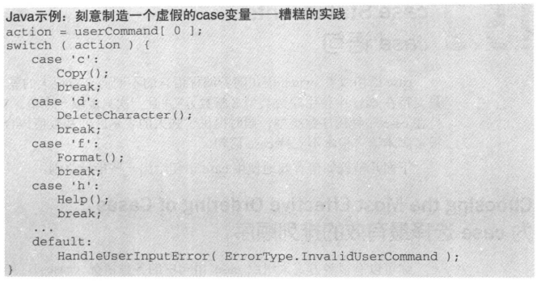

- **把`default`子句只用于检查真正的默认情况**：如果你只有一种情况，并把这种情况的处理写在`default`里，那是不合适的
- **在C++和Java里，避免代码执行行越过一条case子句的末尾**：注意写break
- **在C++里，在case末尾明确无误地标明需要穿越执行的程序流程**：如果有意不写break，要注释说明原因


## 第16章 控制循环

能够导致应用程序反复执行一段代码的结构。常用的循环有`for`、`while`、`do-while`。


### 16.1 选择循环的种类

在大多数语言中，你只能用到少数几种循环

- 计数循环（counted loop）：执行的次数是一定的
- 连续求值的循环（continuously evaluated loop）：预先不知道执行多少次，它会在每次迭代时检查是否应该结束
- 无限循环（endless loop）：一旦启动就会一直执行下去
- 迭代器循环（iterator loop）：对容器类里面的每个元素执行一次


不同的循环种类在灵活性上有差别----有些次数是一定的，有些在循环前判断条件是否成立。而这个判断也可以放在开头、中间、结尾

循环的种类

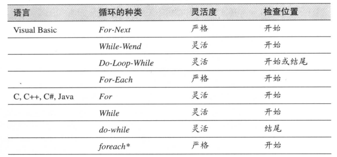


**什么时候使用while循环**

如果预先不知道迭代要迭代多少次，那就使用while循环。检测位于循环开始，那么执行语句不一定会执行到，如果放在结尾，则至少能执行一遍。


**什么时候用带退出的循环**

带退出的循环就是终止条件出现在循环中间而不是开始或者末尾的循环。对C++而言就是带`break`或者`goto`的循环


**1、正常的带退出循环**

带退出循环通常用是在这样的场合下使用：

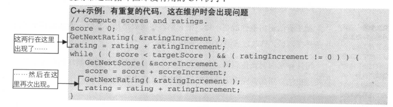

上图中这样有两部分完全相同的代码，在修改的时候容易忘记。下面的代码更清晰

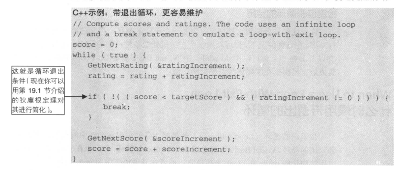

在写这种循环时，需要考虑如下的细节：

- 不要把退出条件写得到处都是
- 用注释来阐明操作意图


**2、非正常的带退出循环**

下面是另一种情况

```c++
//一种不好的做法
int i = 0, a = 0, b = 0;
goto start;
while( i < 10 )
{
	a++;
start:
    b++;
    i++;
}
```

上图以`goto`进入循环，然后以`while`判断来退出循环，这样的做法很少见，因此也不建议。

```c++
//一种好的做法
int i = 0, a = 0, b = 0;
goto start;
while(1)
{
	b++;
    i++;
	if( i < 10 )
    {
        a++;
    }
}
```


**何时使用for循环**

如果你要一个执行次数固定的循环，那可以使用`for`循环。


**何时使用`foreach`循环**

C++不涉及。


### 16.2 循环控制

循环会出如下的错误：

1、忽略或错误地对循环执行初始化

2、忽略了对累加变量或者其他与循环有关的变量执行初始化

3、不正确的嵌套、不正确的循环终止

4、忽略或错误地增加了循环变量的值

5、不正确的循环下标访问数组元素


两种阻止错误发生的方法：

1、减少能影响循环各种因素的数量：影响循环退出的因素尽量少

2、把循环内部当一个子程序看待


**进入循环**

在代码进入循环的时候的一些指导原则：

1. **只从一个位置进入循环**

   比如上文提到的goto进入循环这种不常见的方式

   

2. **把初始化代码紧放在循环前面**

   比如把循环下标的初始化放在循环前面等。这样便于修改和复制整个循环到别的地方

   

3. **用while(true)表示无限循环**

   或者`for( ; ; )`

   

4. **在适当的情况下多使用for循环**

   由于`for`循环把控制条件都写在一起，修改起来的时候更不容易遗漏。而`while(i > 100)`之类的循环容易忘记修改`i`递增的代码

   

5. **在while循环更适用的情况下，不要使用for循环**

​	for循环的头，应该只包含控制语句（那些用于初始化和终止循环，或者用于使循环终止的语句），而不应该塞进业务语句。

```c++
int i = 0, a = 0, b = 0;
for(i = 0; i < 10; a++)
{
	b++;
	i++;	//这个才应该写到第二行，而不是a++
}
```

有些别的会更适合使用while循环。


**处理好循环体**

下面讲解如何处理循环体：

1. **用`{`和`}`把循环中的语句括起来** 

   增加可读性，避免出错

2. **避免空循环**

   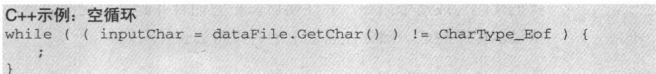

   可以把while那一行的操作拆出来

   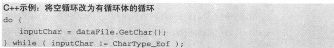

3. **把循环内务操作（i++之类的）要么放在循环开始，要么放在循环末尾**

   把`i++`这类控制循环的语句放开头或结尾，方便查看和修改

4. **一个循环只做一件事**

​	循环应该和子程序一样，一个循环只做一件事


**退出循环**

下面讲如何处理循环尾

1. **设法确认循环能够终止**

   基本要求，要考虑正常、异常情况下都能终止

   

2. **使循环终止条件看起来很明显**

   如果不使用`goto`、`break`，那么终止条件就是明显的，总之，把终止条件放在一个地方

   

3. **不要为了终止循环而胡乱改动for循环下标**

   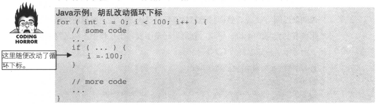

   这样明显是不合适的，一旦写好了for循环，那么它的循环计数器`i`就不应该受你控制了

   

4. **避免出现依赖于循环下标最终取值的代码**

   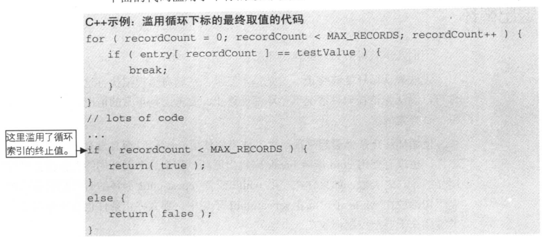

   这种做法很容易出错，如箭头指的地方`<`和`<=`用错之类的，更好的做法

   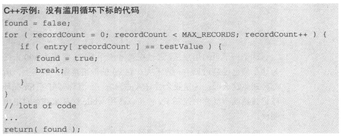

   

5. **考虑使用安全计数器**

安全计数器是一个变量，你在每次循环之后都递增它，一遍判断该循环的执行次数是不是过多。

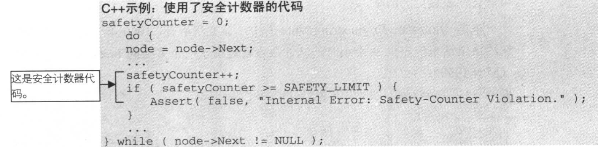

这种方法不能包治百病，因为它增加了复杂度，在修改的时候可能会忘记修改安全计数器相关的代码。


**提前退出循环**

指`break`、`goto`等中途退出循环的方式

一些建议：

1. **考虑在while循环中使用break语句而不用布尔标记**

   直接break，而不是产生布尔标记让循环的判断条件去判断。这样容易理解

   

2. **小心那些有很多break散步其中的循环**

   这可能意味着程序员对该循环的结构或者对循环在围绕它的代码中的角色缺乏清晰的认识。break的位置也可能出错导致意想不到的后果

   

3. **在循环开始处使用continue进行判断**

   一种continue的使用场景：循环中要阅读记录、忽略掉某一种记录而处理另一种

   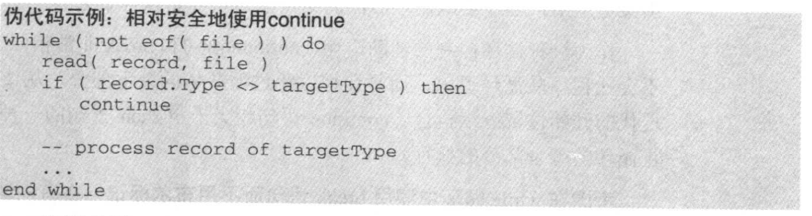

   

4. **如果语言支持，请使用带标号break结构**

   指的是break能指定自己退出的是哪个循环，C++不支持

   

5. **使用break和continue时要小心谨慎**

​	break让循环体无法再作为一个函数了，让人不得不去研究下循环体。所以能不用尽量不用


**检查端点**

检查循环开始的条件、循环过程中的处理、循环结束的条件是否合理正确。


**使用循环变量（i，j之类的）**

一些指导原则

1. **用整数或者枚举类型表示数组和循环的边界**

   

2. **在嵌套循环中使用有意义的变量名来提高可读性**

   比如遍历二维数组，可以把`i`、`j`替换成 `row` 、`col`

   

3. **用有意义的名字来避免循环下标串话（用错下标变量）**

   和第二点差不多，也是给`i`、`j`取个别的名字，因为它们没有意义，所以太容易弄混了

   

4. **把循环下标变量的作用域限定在本循环内**

   ```c++
   for(int i = 0; i < 10; i++);
   //do somethings else
   for(int i = 0; i < 10; i++);
   ```

   像这样在循环只定义循环变量是最好的，上文中的`i`的作用域都仅限于自己处于的`for`循环，但不同的编译器得到的结果不一样，所以还是尽量小心。


**循环应该有多长**

1. 循环要尽可能地短，以便能够一目了然
2. 把嵌套限制在3层以内
3. 把长循环的内容移到子程序内
4. 要让长循环格外清晰


### 16.3 轻松创建循环 -- 由内而外

下面是一般的过程：

从字面量来编写代码，然后缩进它，在外面加上一层循环，然后用循环下标或计算式替换掉那些字面量

先写伪代码注释


将伪代码转成代码

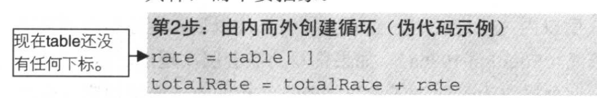

填入下标

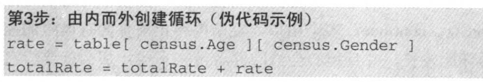

套循环

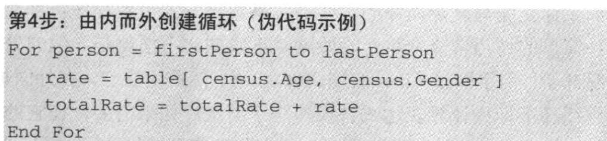

细化

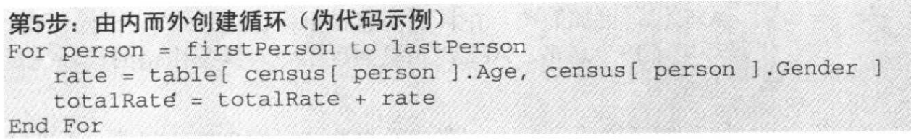

填写初始化

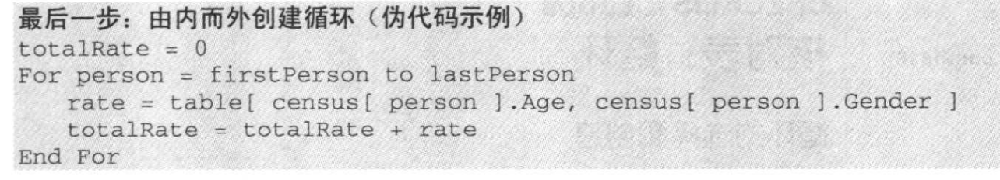


### 16.4 循环和数组的关系

循环常用来操纵数组


## 第17章：不常见的控制结构


### 17.1 子程序中的多处返回

指通过`return`、`exit`等控制结构，在任何需要的时候退出子程序。下面是一些指导原则

1. **如果能增强可读性，那么使用`return`。**

   某些子程序里，一旦知道了答案就马上返回

2. **用防卫子句（guard clause）（早返回或者早退出）来简化复杂的错误处理。**

   指函数开始时的各种异常判断，如果发现异常，则提前退出，这样形成的多处返回。

   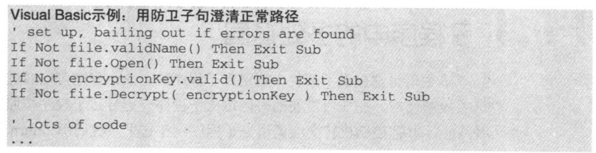

3. **减少每个子程序中`return`的数量。**

   太多的话可能会导致看后面的代码时意识不到前面已经退出了。


### 17.2 递归

在递归 （recursion）里面，一个子程序自己负责解决某个问题的一小部分， 它还把问题分解成很多的小块，然后调用自己来分别解决每一小块。当问题的小部分很容易解决，而问题的大部分也很容易分解成众多的小部分时，常常会用到递归。

使用得好的话，可以显得很优雅

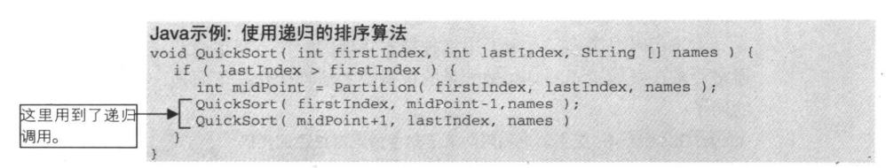


**递归的例子**

假设你有一个表示迷宫的数据类型。从本质上来说，迷宫就是一个网格，在 网格的每一个点，你都有可能向上下左右四个方向移动。

你通常可以往不止一个方向移动。

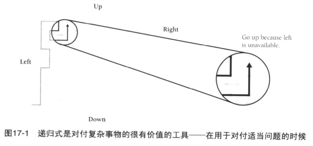

```c++
bool FindPathThroughMaze ( Maze maze, Point position ) 
{
	// if the position has already been tried, don't try it again
	if ( AlreadyTried ( maze, position ) ) {return false;}
	
	// if this position is the exit, declare success
	if (ThisIsTheExit (maze, position) ) {return true;}
	
	// remember that this position has been tried
	RememberPosition ( maze, position );
	
	// check the paths to the left, up, down, and to the right; if
	// any path is successful, stop looking
	if ( MoveLeft ( maze, position, &newPosition ) ) 
	{
		if ( FindPathThroughMaze ( maze, newPosition ) ) 
		{
			return true;
		}
	}
	
	if ( MoveUp ( maze, position, &newPosition ) ) 
	{
		if ( FindPathThroughMaze ( maze, newPosition ) ) 
		{
			return true;
		}
	}
	
	if( MoveDown ( maze, position, &newPosition ) )
    {
    	if (FindPathThroughMaze (maze, newPosition )) 
    	{
    		return true;
    	}
    }
    
    if( MoveRight ( maze, position, &newPosition ) ) 
    {
    	if (FindPathThroughMaze ( maze, newPosition ) ) 
    	{
    		return true;
    	}
    }
    return false;
}
```


**使用递归的技巧**

1. **确认递归能够停止**

   检查子程序以确认其中包含一条非递归的路径，像上文的`AlreadyTried`和`ThisIsTheExit`

2. **使用安全计时器防止出现无穷递归**

   通过安全计时器限制执行的次数，防止无穷递归

3. **把递归限制在一个子程序内**

   不要循环递归（A调用B，B调用C，C调用A），这样很难理解，也容易出错

4. **留心栈空间**

   由于函数一直没退出，每调一次就申请栈，当递归层次太深，容易导致线程的栈溢出。可以考虑改用堆（malloc或者new）内存

5. **不要用递归去计算阶乘或者斐波那契数列**

   可以用递归实现，但使用循环会更容易懂。所以不要把代码写复杂了


### 17.3 goto

针对`goto`的争议一直存在，下面是一些论点：


**反对goto的论点**

1. **没有`goto`的代码更容易证明其正确性。**

2. **含有`goto`的代码很难安排好格式。**

   它影响缩进

3. **使用`goto`会破坏编译器的优化特性。**

   有些优化要求程序的控制流程位于不多的几个语句之间，而无条件的goto会使得流程很难分析

4. **使用`goto`的示例中，它会使运行速度更慢，而且代码更大。**


**支持goto的论点**

**支持者也普遍强调要在特定的场合下谨慎地使用`goto`**

1. **如果使用位置恰当，goto可以减少重复的代码。**
2. **goto在分配资源、使用资源后再释放资源的子程序中非常有用。**
3. **在某些情况下，使用`goto`会让代码运行速度更快，体积更小。**
4. **编程水平高不等于不使用`goto`。**
5. **在对`goto`做了几十年研究后，人们还是无法证明它是有害的。**
6. **很多现代语言已经包含`goto`。**


**关于`goto`的虚假辩论**

人们对于`goto`的争论很肤浅，仅仅是用于说明用或者不用带来了某个很小的好处，然后就说应该在任意场合都使用或者不使用。

下面是一些多数程序员都赞成使用`goto`的场景举例：


**错误处理和goto**

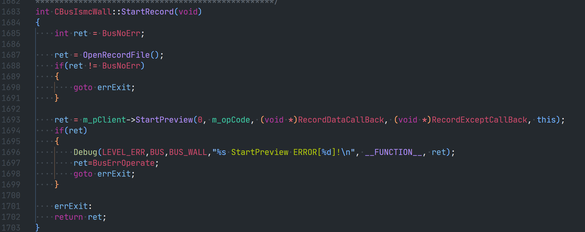

如果你不想使用goto，那可以使用以下的几种方法代替：

1. 用嵌套的`if`语句重写

2. 用一个状态变量重写代码

   比如创建一个变量叫`errState`，记录当前程序的状态

3. 用try-finally重写

   C++不支持，不做叙述

   

**各种方法之前的比较**

**goto**的方法避免了深层的嵌套和不必要的检测

嵌套`if`的方法避免了使用`goto`,但它的嵌套太多了，并且增加了子程序的复杂度

使用状态变量避免了了使用`goto`和深层嵌套，但也引入了额外的检测。


**goto和在else子句中的代码共享**

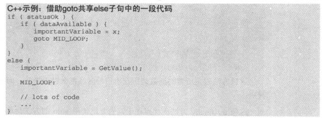

上图这种场景下可以使用goto，如果是C++的话，也可以使用下面的写法：

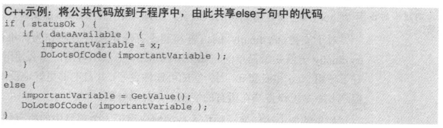


**goto使用原则总结**

- 在那些不支持结构化控制语句的语言中，使用goto去模拟那些控制结构，但要准确地模拟
- 在已经支持结构化控制语句的语言中，不要用goto
- 如果为了提升效率而使用goto，评估下提升的效果多大，是否有必要
- 除非你要模拟结构化语句，否则尽量在每个子程序中只使用一个goto标号
- 除非你要模拟结构化语句，否则尽量让goto向前跳转而不是向后
- 确认所有的goto标号都被用到
- 确认goto不会产生某些执行不到的代码
- 如果你是经理，需要知道使用goto也不是不可以，没必要纠结


### 17.4 针对不常见控制结构的观点

软件开发对这些不常见的控制结构的观点也在不断变化。


## 第18章：表驱动法

表驱动法是一种编程模式（scheme）一从表里面查找信息而不使用逻辑语 句（if和case）。

事实上，凡是能通过逻辑语句来选择的事物，都可以通过查表来选择。对简单的情况而言，使用逻辑语句更为容易和直白。

但随着逻辑链的越来越复杂，查表法也就愈发显得更具吸引力。


### 18.1 表驱动法使用总则

在适当的环境下,采用表驱动法,所生成的代码会比复杂的逻辑代码更简单、 更容易修改,而且效率更高。

假设你希望把字符划分成字母、标点符号和数字三类,那么你也许会用到下面这种复杂的逻辑链:

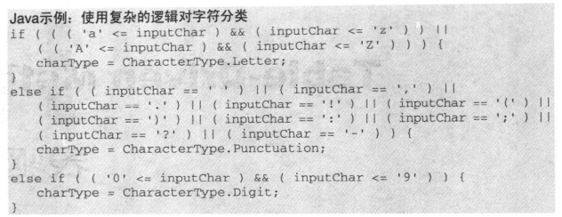

如果使用一个查询表，就可以把每一个字符的类型保存在一个用字符编码访问的数组里，那么上面的代码可以替换为：

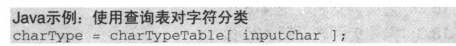


**使用表驱动法的两个问题**

1、怎么从表中查询条目。

如果你希望把数据按月进行分类，那么创建一个月份表是非常直截了当的，你可以创建一个下标从1~12的数组实现它。

另一些数据可能很难直接用于查表。例如，假设你希望按照社会安全号码做 数据分类，那么除非你可以承受在表里面存放999-99-9999条记录，

否则就不能用 社会安全号码直接查表。你会被迫采用一种更为复杂的方法。下面是从表里面查 询记录的方法列表：

- 直接访问（Direct access）
- 索引访问（Indexed access）
- 阶梯访问（Stair-step access）

2、你应该在表里面存些什么。

有时候，表查询出来的结果是数据，那么应该存数据。有时候查询出来的结果是动作，，那么应该存描述该动作的代码（函数）


### 18.2 直接访问表

直接访问是因为你无需绕很多复杂的圈子就能够在表里找到你想要的信息。


**示例一：一个月中的天数**

如果要计算计算每个月的天数（不考虑闰月），那么笨办法是写一堆`if else`。

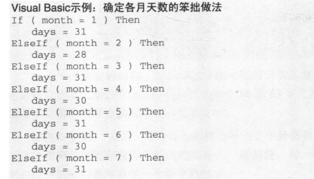

如果用直接访问表的方法的话，可以简化为：

```c++
int daysPerMonth[12] = {31,28,31,30,31,30,31,31,30,31,30,31};
int days = daysperMonth[month - 1];
```


**示例二：保险费率**

假设你在写一个计算医疗保险费率的程序,这些费率是随着年龄、性别、婚姻状况以及吸烟与否的不同情况而变化的。

如果你不得不用逻辑控制结构来表示 不同费率的话,那么可能会写出下面的代码:

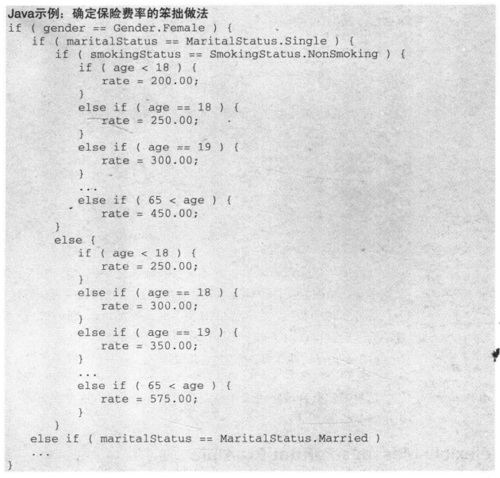

上面的代码已经简化过了，没有显示已婚女性、所有的男士或者16~65岁之间的人士，这样的判断太复杂了。

更好的方法是把这些费率存入所有因素（年龄、性别、婚姻、抽烟情况等）索引的表里。

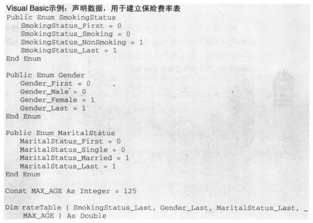

在声明了这个数组以后,你还需要找一种把数据存进去的方法。你可以使用赋值语句、从磁盘文件中读入数据、计算出这些数据、或者执行任何合适的操作。

 一旦备好了这些数据,在需要计算费率时,你就可以直接获取结果了。前面那段 复杂的逻辑就可以用类似于下面这样简单的语句取而代之:


**例子:灵活的消息**

如果使用场景是读取一大堆文件，每个文件中有若干个数据，每个数据都有个ID标识它代表什么，是什么类型。需要设备读取文件后将这些数据打印出来。

假设文件中有如下几类数据：

```
ID = 1 代表：平均温度 数据类型：float
ID = 2 代表：经度     数据类型：double
ID = 3 代表：维度	 数据类型：double
ID = 4 代表：采样点数  数据类型：int
......
```

基于逻辑的方法就需要判断ID的值，有多少个ID种类，就定义多少个子函数用于打印该种类数据。

```c++
if(ID == 1) 		printAvangeTemper();	//打印“平均温度:20”
else if(ID == 2)	printlongitude();		//打印“经度：111”
......
```

而使用表的话，可以更简洁，将ID对应的文字和打印函数都写到表内，这样就可以只写几个打印基本数据类型的函数就可以了

```c++
DATA_FORMART data[10] = 
{
    //ID   文字          打印函数
	{1,    "平均温度："，printFloat},
	{2,    "经度："，    printDouble},
	......
};
```

这样只要拿着ID，就可以取出文字，然后用打印函数打印下数据就可以了，不需要创建那么多子函数。


**构造查询键值**

上面的例子中，我们查询表的时候使用的是`月份`、`ID`这样容易获取的数据，但是有时候键值会很难定，比如上面保险费率的例子。

关于`age`这个键值，由于小于等于17岁是费率A，18~65是费率B，大于65是费率C，所以你拿15去查表的时候可能查不到，因为1~17只有一条数据。

```c++
DATA data[]=
{
	//年龄，费率
	{17,  0.01},
    {18,  0.02},
    {19,  0.03},
    ......
    {65,  0.11},
    {66,  0.22},
};
```

所以，我们应该使用什么键值呢？下面是一些构造键值的方法

- 复制消息从而能够直接使用键值

  上面例子而言，就是给在表中塞入17条一样的数据，只有年龄不一样

- 转换键值以使其能够直接使用

  上面的例子而言，如果表中17岁及以下使用的key都是17，那么用户在查询的时候，要把1~17的键值统一改成17再查询

- 把键值转换提取成独立的子程序

  上面的这种转化，可以考虑写成一个专门的函数

  

### 18.3 索引访问表

有时候，很难像上面的age那样简单的转化得到键值。这个时候可以使用索引查询表

当你使用索引的时候,先用一个基本类型的数据从一张索引表中查出一个键 值,然后再用这一键值查出你感兴趣的主数据。

假设你有一家商店，有100种商品，你要查询某个商品的说明，可以通过4位商品编码（0000~9999）查询。

那么你需要查询一张10000行的表（虽然大部分是空的），从里面可以得到一个索引，拿着这个索引可以从另一张表中得到商品说明。

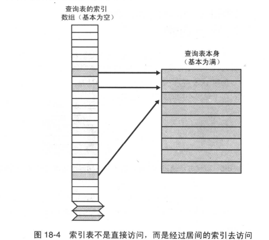

索引访问技术的优点：

- 如果主查询表中每一条数据都很大，那么创建一个10000大小的索引数组比创建一个10000大小的主查询表要节省空间
- 更灵活，对同一份查询表，可以创建多份索引表，比如上面的例子除了可以创建商品编码的索引表外，还可以创建入库时间的索引表等


### 18.4 阶梯访问表

还有另外一种访问表的方法,那就是阶梯访问。这种访问方法不像索引结构 那样直接,但是它要比索引访问方法节省空间。

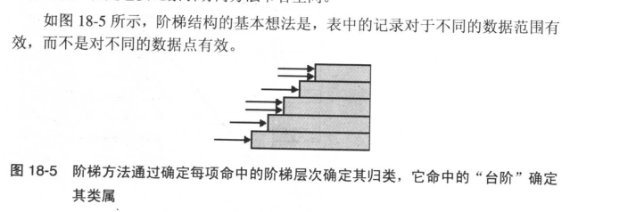

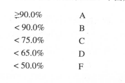

上面的例子里，查询键值就很难定，因为是浮点数，所以列不完，这里比较适合用阶梯访问。

为了使用阶梯方法,你要把每一区间的上限写入一张表里,然后写一个循环, 按照各区间的上限来检查分数。

当分数第一次超过某个区间的上限时,你就知道相应的等级了。在使用阶梯方法的时候,你必须要谨慎地处理范围的端点。

下面就是根据这个例子写的、 用 Visual Basic 来为一组学生成绩评判等级的代码:

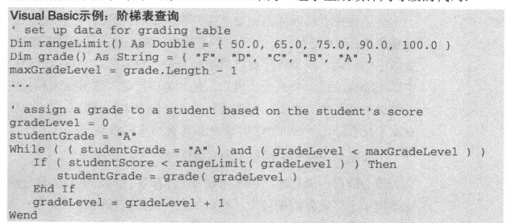

这样的写法和灵活，修改起来很方便

在使用阶梯技术的时候要注意一些细节：

**留心端点**

每个阶梯之间的边界不要写错

**考虑用二分查找取代顺序查找**

查找数据处于哪个阶梯时，如果阶梯很多，二分查找会更快

**考虑用索引访问来取代阶梯技术**

阶梯访问可能会比较耗时，如果对时间要求高的话，可以考虑使用索引

**把阶梯表查询操作提取成单独的子程序**


## 第19章：一般控制问题


### 19.1 布尔表达式

除了最简单的、要求语句按顺序执行的控制结构之外，所有的控制结构都依赖于布尔表达式的求值。


**用true和false做布尔判断**

在布尔表达式中应该用true和false，而不是使用0或者1。如果使用0和1，会难以看出究竟是结尾为真还是假的时候执行这些函数调用。


**隐式地比较布尔值与true和false**

比如`if(a>b)`，这样可以使代码更简洁


**简化复杂的表达式**

简化表达式的多种方法：

- **拆分复杂的判断并引入新的布尔变量**

  把复杂的判断拆成多个简单的判断，并用中间变量承接

- **把复杂的表达式做成布尔函数**

  如果某项判断需要重复做，或者会搅乱对程序主要流程的理解，可以把它写成一个函数，然后判断它的返回值

- **用决策表代替复杂的条件**

  C++不支持

  

**编写肯定形式的布尔表达式**

“我并非不是一个不傻的人”，像这样的话很难懂，应该尽量避免把复杂否定形式的逻辑表达式引入程序：

**在`if`语句中，把判断条件从否定形式转化为肯定形式，并且互换if和else子句中的代码**

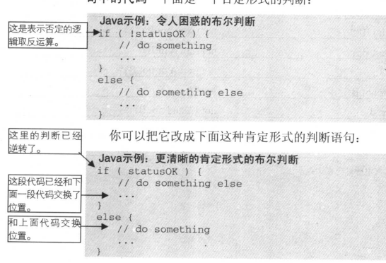

**用狄默根定理简化否定的布尔判断**

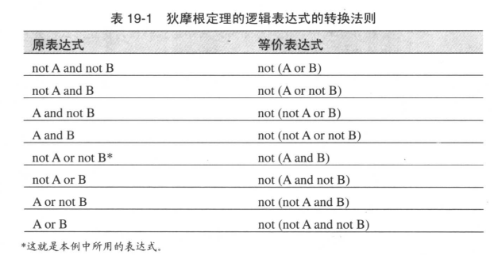


**用括号使布尔表达式更清晰**

```c++
if(a < b == c == d)	//括号过少
if((a < b) == (c == d)) //加了括号后
```


**用一种简单的计数技巧来使括号对称**

没多大意义，现在的编译器都会报错了


**把布尔表达式全放在括号里面**

这是一种好习惯


**理解布尔表达式是如何求值的**

有些语言的计算表达式时，会将每个项的值都算出来，再组合起来得到最后的值。

而有的语言，会采用短路（short-circuit）或者惰性（lazy）求值，只求那些必须的部分。比如两个&&的项，第一个失败了，那第二个就不用算了。

所以，要清楚自己使用的语言属于哪种(C++属于第二种)

```c++
int a[10];
if(i < 10 && a[i] != 0)		//这种写法可能错误
```


**按照数轴的顺序编写数值的表达式**

```c++
if(10 < i && i < 20 )	//按照数轴的顺序容易阅读
if(20 > i && i > 10)    //逆数轴顺序不容易理解
```


**与0比较的指导原则**

**隐式地比较逻辑变量**

```c++
while(!done)
```

**把数和0相比较**

```c++
while(balance != 0)
```

**在C中显式地比较字符和终止符`\0`**

```c
while(*charPtr != '\0')
```

**把指针与NULL进行比较**

```c++
while(bufferPtr != NULL)
```


**布尔表达式常见问题**

- **在C家族语言中，把常量放在比较的左端**

  ```c++
  if(1 == a)	//保险的写法
  ```

- **在C++中，可以考虑创建预处理宏来替换&&，||和==（不得已才这么做）**

  上面的情况的另一种解决办法是把`==`写成一个宏

- **在Java中，应理解`a==b`和`a.equals(b)`的差异**

  不介绍了

  

### 19.2 复合语句（语句块）

也就是那些使用`{ }`包裹起来的语句，下面是一些指导原则：

- **把括号对一起写出**

- **用括号来把条件表达清楚**

  把`if`后面的执行语句用括号括起来


### 19.3 空语句

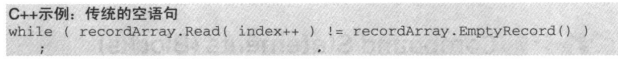

**小心使用空语句**

因为不多见，所以要凸显出来，比如像上面那样单独一行，甚至用{}包起来

**为空语句创建一个`DoNothing`预处理宏或内联函数**

也是为了凸显出这个空语句

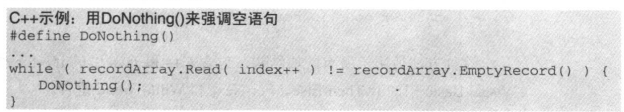

**考虑如果换用一个非空的循环体，是否会让代码更清晰**


### 19.4 驯服危险的深层嵌套

过分深层的缩进，或者嵌套，会让代码难以理解，增加出错的概率，应该避免，下面是一些建议：

- 通过重复检测条件中的某一部分来简化嵌套的`if`语句

  ```
  if(a)
  {
  	if(b)
  	{
  		if(c)
  		{
  			if(d)
  		}
  	}	
  }
  ```

  可以改为

  ```c
  if(a)
  {
  	if(b)
  	{
  	}	
  }
  
  if(a && b && c)
  {
  	if(d){}
  }
  ```

- 用`break`块来简化嵌套`if`

  可以改成

  ```c++
  do
  {
  	if(!a)	break;
  	//do something 
  	
  	if(!b)	break;
  	//do something 
  	
  	if(!c)	break;
  	//do something 
  	
  	if(!d) break;
  	//do something 
  }while(0);
  ```

- 把嵌套`if`转换成一组`if-then-else`语句

  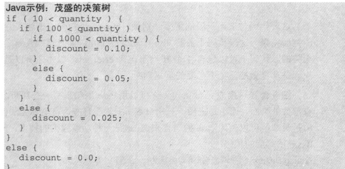

  可以修改为

  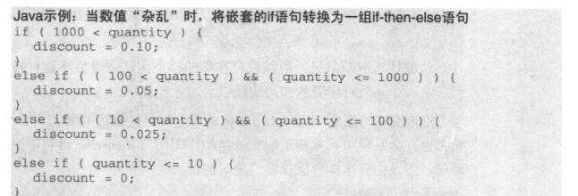

- 把嵌套`if`转换成`case`语句

  如果你使用的语言支持`case 0 to 10`这样的写法，可以将上面的例子写成`switch case`

- 把深层嵌套的代码抽取出来放进单独的子程序

  把嵌套的一部分提出来做成函数

- 使用一种更面向对象的方法

  使用多态

  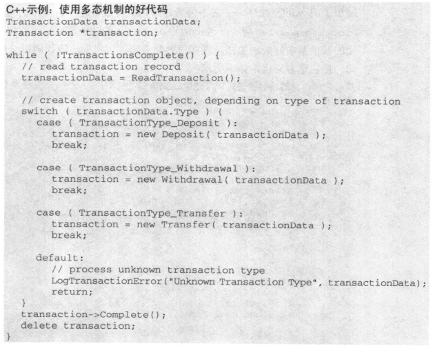

- 重新设计深层嵌套的代码

​	重新设计。在面向对象的语言中出现case，说明代码没有做好分解


### 19.5 编程基础：结构化编程

结构化编程的核心思想很简单,那就是一个应用程序应该只采用一些**单入单出的控制结构**(也称为单一入口、单一出口的控制结构)。

单入单出的控制结构指的就是一个代码块,它只能从一个位置开始执行,并且只能结束于一个位置。除此之外再无其他入口或出口。

结构化编程和结构化的、自上而下的设计不完全一样。前者只适用于具体编码层。

一个结构化的程序将按照一种有序的且有规则的方式执行,不会做不可预知的随便跳转。

你可以按自上而下的方式阅读它,而它执行起来也大体是遵循这个顺序的。

使用规则性不强的方法所生成的源代码,很难有意义且形象地反映出程序是如何在机器上执行的。可读性差意味着不容易理解,最终导致应用程序的低质量。


**结构化编程的三个组成部分**

**顺序：**"顺序"指一组按照先后顺序执行的语句。典型的顺序型语句包括赋值和调用子程序。

**选择：**选择是一种有选择的执行语句的控制结构。

**迭代：**也就是循环结构


### 19.6 控制结构和复杂度

控制结构用得不好就会增加复杂度，反之能降低复杂度。


**复杂度的重要性**

复杂度相关的可以参考 **5.2 关键的设计概念-复杂度**


## 第20章：软件质量概述

本章从构建的角度审视保障软件质量的技术。


### 20.1 软件质量的特性

软件同时拥有**外在**的和**内在**的质量特性。

**外在**特性是指该产品的用户所能感受到的部分，包括：

- **正确性。**缺陷尽量少
- **可用性。**用户学习和使用的容易程度
- **效率。**尽可能少地占用资源，包括内存和时间
- **可靠性。**在指定的必需条件下，应该有很长的平均无故障时间
- **完整性。**对非法访问的限制和保证并行访问的正确性
- **适应性。**使用场景变化后还能正常运行
- **精确性。**输出结果的误差程序，表示完成工作的优劣程度
- **健壮性。**在收到无效输入或者处于压力环境下还能正常运行

质量的外在特性是用户关心的唯一软件特性。用户只会关心软件是否容易使 用,而不会关心对于程序员来说修改起来是否容易。

他们关心软件是否能正确运行,而不关心里面的代码是否可读,或者是否有良好的结构。 

而程序员除了关心软件质量的外在特性之外,还要关心它的内在特性。本书的核心是代码,所以它更关注软件**内在**的质量特性。

内在质量特性如下：

- **可维护性。**是否能够很容易地对系统进行修改，改变或者增加功能，提高性能，以及修正缺陷。
- **灵活性。**如果这个系统是为特定环境设计的，当环境变化时，需要修改的量有多大
- **可移植性。**在原来设计的特定环境之外是否能运行
- **可重用性。**系统的某些部分能不能被用到别的系统中，是否容易
- **可读性。**阅读代码的难易程度
- **可测试性。**能否通过单元测试或者系统测试验证功能的实现程度
- **可理解性。**在系统组织和细节语句的层次上理解整个系统的难易程度（理解框架的难易程度？）

内在质量特性会影响外在质量特性。比如内部都难以理解的代码，在外部就会更大概率地暴露缺陷。

内在特性强调让程序员维护起来方便，外在特性强调让用户使用起来方便，有时候两者是冲突的。

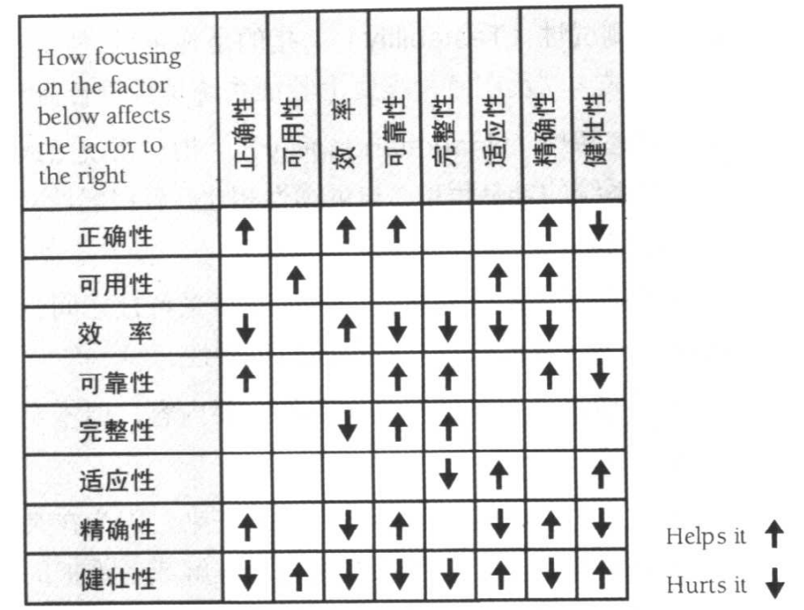


### 20.2 改善软件质量的技术

软件质量中的某些要素：

- **软件质量目标。**明确指出项目追求的是哪些特性
- **明确定义质量保证要求。**在组织内宣扬软件质量的重要性，不要输出“快速但糟糕”的代码
- **测试策略。**测试要根据需求、架构和设计相关联的测试策略，别瞎测。要通过测试验证质量
- **软件工程指南。**按软件开发流程走，定义问题 - 需求分析 - 架构设计 - 构建 - 系统测试
- **非正式技术复查。**代码走读
- **正式技术复查。**越早发现问题越好，所以开发流程进入下一个环节的时候，都要有验收标准，达到指标才能走下一个流程
- **外部审查。**让开发组织以外的人审查


**开发过程**

上面的要素，和软件开发流程都有关系，具备下面各项质量保证活动的开发流程，能生产出更好的软件。

- **对变更进行控制的过程。**需求变更、设计变更、代码变更都会引入风险。所以要严格控制变更
- **结果的量化。**质量保证计划到底有没有起效果，要能够用数据体现出来
- **制作原型。**先写关键功能的demo来验证可行性和评估时间


**设置目标**

明确告诉程序员软件的质量目标，也就是看重哪一方面。如果你强调了追求的方向，程序员也会往这方面努力。

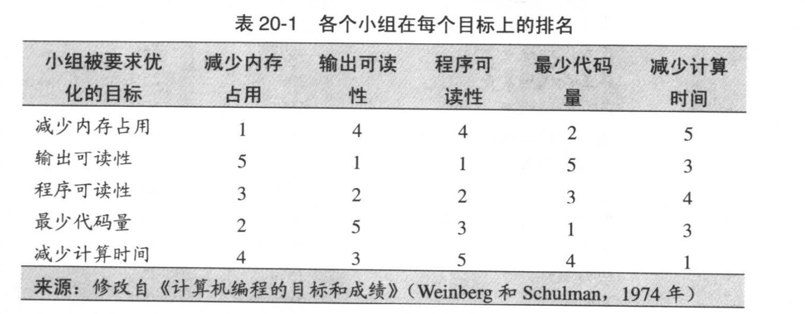


### 20.3 不同质量保障技术的相对效能

各种质量保证方法的效能不同，人们研究了它们在检出缺陷和排除缺陷方面的效能。


**缺陷检测率**

不同的方法能检测出不同类型的缺陷，指标是检出缺陷数占总缺陷数的比例。下面是几种常见的缺陷检出方法的缺陷检测率。

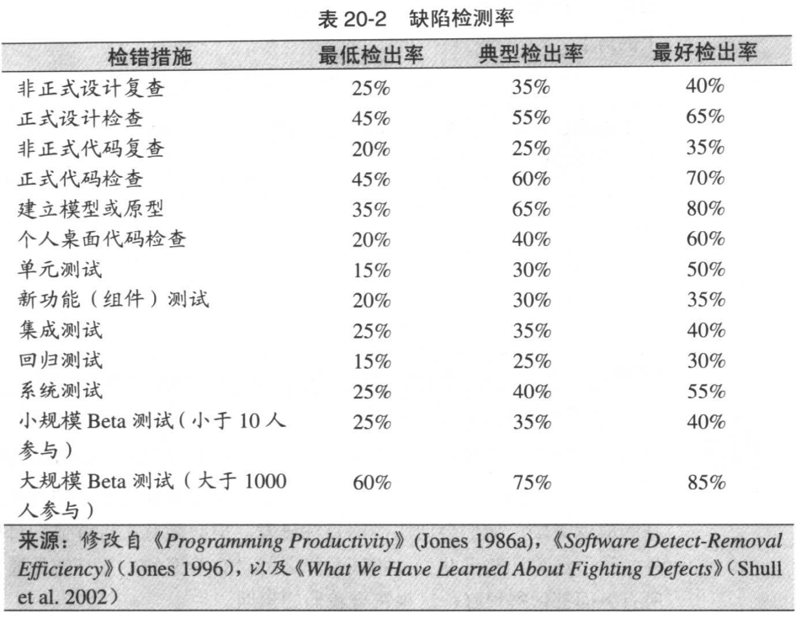

上面可以看到，单独使用任意一项方法，其典型检出率都没有超过75%，并且平均下来只有40%左右，典型的单元测试和集成测试的检出率也只在30%~35%。

所有，我们要综合使用各项检测技术，来提高缺陷检出率。组合使用多个方法的效果比单独使用某个方法的效果要好。

研究显示：阅读代码能找到更多的接口缺陷，功能测试能检测出更多的控制缺陷。


**找出缺陷的成本**

检测也要考虑成本，最经济的方法是找出缺陷的成本最低，而其他方面和别的方法差不多。

大部分研究表明，检查代码比测试的成本更小，也就是缺陷越早发现越好，最好是在开发阶段发现。


**修正缺陷的成本**

一个缺陷存在的时间越长，消除它的代价就越昂贵。因此越早发现缺陷也能降低修正缺陷的成本。

检查代码可以一次性确定现象和原因，而测试只能找到现象，无法找到原因，所以要在开发阶段多注意检查。


下面是一台推荐的测试策略：

- 对所有的需求、架构以及系统关键部分的设计进行正式检查
- 建模或者创建模型
- 代码阅读或者检查
- 执行测试


### 20.4 什么时候进行质量保证工作

越早引入的缺陷，在后面的环节中就会引入越多越严重的错误，所以在软件工程的早期就要开始强调质量保证。


### 20.5 软件质量的普遍原理

软件质量的普遍原理是改善质量以降低开饭成本。

提高生产效率和改善质量的最佳途径是减少花在代码返工上的时间。

程序员每天花大量的时间在调试和解决缺陷中，所以只要避免引入错误，就能减少调试时间，从而提高生产率 :thinking:。


上图可以看出，写出高质量程序的方法有两个：

1、在编码前做足准备，减少调试的时间

2、在开发中做足检查，以时间换质量
